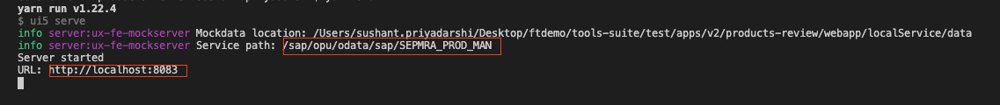

# Samples for SAP Fiori tools

### Description
This project contains sample SAP Fiori elements projects built using SAP Fiori tools. These sample projects will be primarily referenced from blogs and tutorials grouped in folders according to application scenario.

### Requirements
1. Node.js based on your platform - [download Node.js](https://nodejs.org/en/download/).

### Download and Installation

1. Clone the repository or download it to your file system.
2. From the terminal, go to a sample app/project (as instructed in the referencing tutorials) e.g. `V2/apps/products-review`.
3. Type `npm install` to install all the dependencies.
4. Type `npm start` to host the sample SAP Fiori elements application locally. 
- To view the application with mock data, click on the `URL`.
- To use the associated mock OData service, combine values of `URL` and `Service Path`.

E.g. From the above example, combining both the values gives you `http://localhost:8083/sap/opu/odata/sap/SEPMRA_PROD_MAN`

### Known Issues
There are no known issues relating to the resources included in this repository. Please refer to **How to obtain support** for any issue you encounter.

### How to Obtain Support
- Option 1 : Users can log in and [submit their question](https://answers.sap.com/questions/ask.html) in the **SAP Community**. Please select the tag "SAP Fiori tools".
- Option 2 : Use this option ONLY when you encounter any issues using the sample project with [SAP Developer tutorials](https://developers.sap.com/group.fiori-tools-lrop.html), please report it [here](https://github.com/SAPDocuments/Tutorials/issues/new).

### License
Copyright (c) 2009-2020 SAP SE or an SAP affiliate company. This project is licensed under the Apache Software License, version 2.0 except as noted otherwise in the [LICENSE](/LICENSES/Apache-2.0.txt) file.
