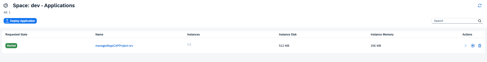
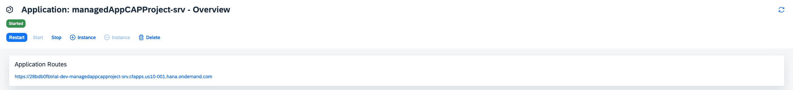
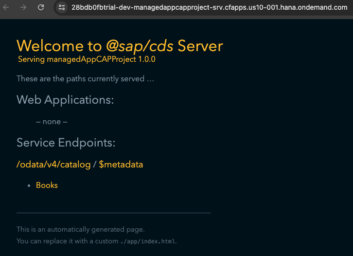
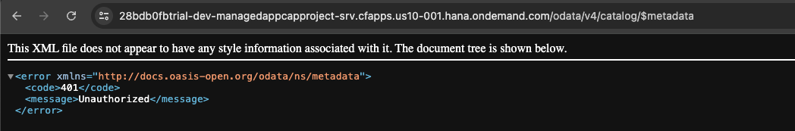
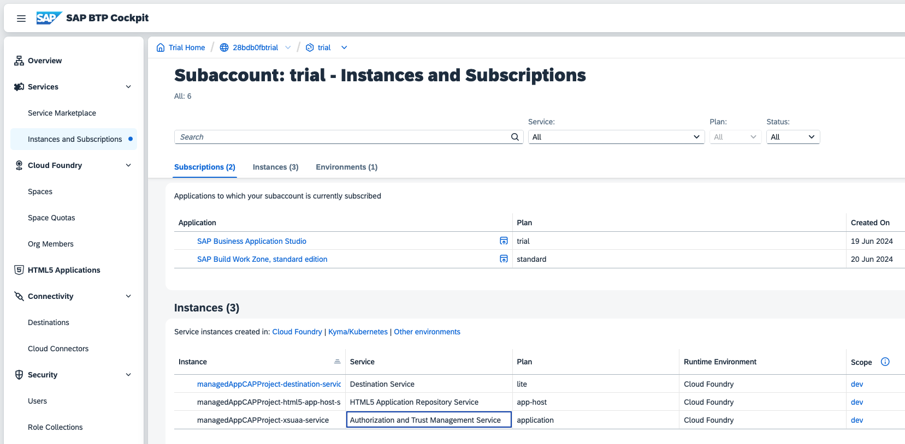
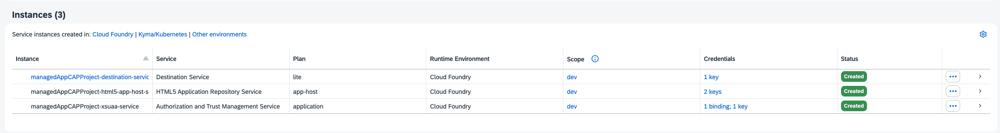
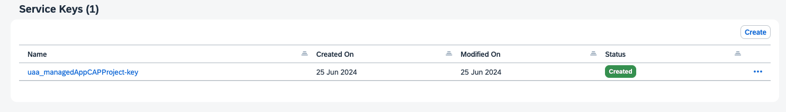
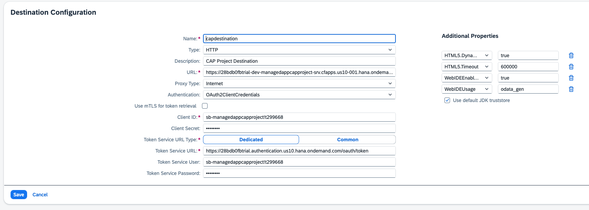
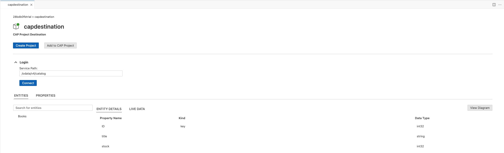

# Expose a deployed CAP project as an SAP BTP destination

## Prerequisites

- You have an SAP BTP account, for example a [trial account](https://account.hana.ondemand.com/)
- You are subscribed to the SAP Build Work Zone, follow this [tutorial](https://developers.sap.com/tutorials/cp-portal-cloud-foundry-getting-started.html) for more information
- You have deployed a CAP project with a SAPUI5 Fiori UI using this [blog post](https://community.sap.com/t5/technology-blogs-by-sap/build-and-deploy-a-cap-project-node-js-api-with-a-sap-fiori-elements-ui-and/ba-p/13537906)
- You are exposing the SAP BTP destination from the same subaccount where the CAP project is deployed

## Description

For more information about destinations, see this [blog post](https://community.sap.com/t5/technology-blogs-by-members/sap-btp-destinations-in-a-nutshell-part-3-oauth-2-0-client-credentials/ba-p/13577101).

Step 1: Access your `nodejs` service, selecting your dev space, which will list all the running services on your space;

[](Step1.png)

Step 2:  Select the `nodejs` service which will expose the CAP endpoint.

[](Step2.png)

In this case, the endpoint is;

`https://28bdb0fbtrial-dev-managedappcapproject-srv.cfapps.us10-001.hana.ondemand.com`

[](Step2b.png)

When you select any of the exposed services, for example;

```text
https://28bdb0fbtrial-dev-managedappcapproject-srv.cfapps.us10-001.hana.ondemand.com/odata/v4/catalog
```

you will receive a `HTTP 401 unauthorized error` since you aren't passing the appropriate headers to the application otherwise your application would be exposed to the internet with no security;

[](Step2c.png)

Step 3: Access your Security XSUAA credentials

Navigate back to the root of your subaccount and select `Instances and Subscriptions`.

[](Step3.png)

Step 4: Select the `Authorization and Trust Management Service` service instance that was deployed with your CAP project. In this example: `managedAppCAPProject-xsuaa-service`.

[](Step4.png)

Step 5: Select the `Service Keys` tab. If a key doesn't exist, create a new service key.

[](Step4.png)

In the service key, you will need the following properties;

- clientid
- clientsecret
- url

For example;

```text
sb-managedappcapproject!t299668
xGRgYPoAXbMv2gqRIDontThinkSooZ7uY=
https://28bdb0fbtrial.authentication.us10.hana.ondemand.com
```

Step 6: Create a new destination in your SAP BTP account, navigate to the `Connectivity` service and select `Destinations` and `Create destination` and change the `Authentication` type to `OAuth2ClientCredentials`.

```json
Name: capdestination
Description: CAP Project Destination
URL: from step 2 i.e. https://28bdb0fbtrial-dev-managedappcapproject-srv.cfapps.us10-001.hana.ondemand.com
Client ID: from step 5 i.e. sb-managedappcapproject!t299668
Client Secret: from step 5 i.e. xGRgYPoAXbMv2gqRIDontThinkSooZ7uY=
Token Service URL: from step 5 i.e. https://28bdb0fbtrial.authentication.us10.hana.ondemand.com appended with /oauth/token
Token Service user: same as client ID
Token Service password: same as client secret
HTML5.Timeout: 60000
WebIDEEnabled: true
WebIDEUsage: odata_gen
HTML5.DynamicDestination: true
HTML5.Timeout: 60000
Authentication: OAuth2ClientCredentials
```

Please note, you need to append `/oauth/token` to the `Token Service URL` property.

Save the destination and you should see the following;

[](Step6.png)

Using a SAP BTP destination with `OAuth2ClientCredentials` is typically used to authenticate a service or application (Client Credentials Grant) rather than a user. To switch to using a Token Exchange Grant, change the `Authentication` type to `OAuth2UserTokenExchange` which is typically used to authenticate a user across systems (Token Exchange Grant) which will remove the requirement to have a `Token User` and `Token Service Password` in the destination configuration.

Step 7: Let's confirm everything works!

Login into Business Application Studio and select `Service Centre` on the left navigation bar;

[](Step7.png)

Select the destination you created `capdestination` and it will show the status as `Not Available` since you need to append the service path;

Enter the path to the service you want to access i.e. `/odata/v4/catalog` and click `Connect`;

[](Step7b.png)

Another way to test the destination is to use `curl` from a terminal window;

```bash
curl -L "https://capdestination.dest/odata/v4/catalog" -vs > curl-cap-output.txt 2>&1
```

This will generate a file called `curl-cap-output.txt` with the output of the request; you should see the OData being returned;

```JSON
{
  "@odata.context": "$metadata",
  "@odata.metadataEtag": "W/\"kpKGEWiUkdl2tvln8+lIbb+WgNsbQRujr+H11i5pAUg=\"",
  "value": [
    {
      "name": "Books",
      "url": "Books"
    }
  ]
}

```

You can now use the SAP Fiori tools generator to start generating HTML5 applications that consume the OData services from your CAP project services.

## Want to Go Cross-Subaccount and Regions

See [SAP BTP: How to call protected app across regions with SAML and OAuth](https://community.sap.com/t5/technology-blog-posts-by-sap/sap-btp-how-to-call-protected-app-across-regions-with-saml-and-oauth-2/ba-p/13546145).

Key points to remember:

- **Trust must be configured on the back-end subaccount:** Download the IdP metadata from the frontend subaccount (using Connectivity > Destinations > Download IDP Metadata) and register it as a new trust configuration in the back-end subaccount (Security > Trust Configuration). Uncheck "Available for User Logon" — this trust is for app-to-app calls only.
- **The destination is created in the frontend subaccount, not the back-end:** The `OAuth2SAMLBearerAssertion` destination lives next to the app that makes the call. It requires three values from the back-end's SAML metadata: the `entityID` (Audience), the `AssertionConsumerService` URI-binding URL (Token Service URL), and the `nameIDFormat` (added as an additional property).
- **Token exchange is required to call the destination service:** You cannot use client credentials alone. The user JWT token must contain the `uaa.user` scope, which requires assigning the corresponding role collection to the user in the frontend subaccount. Token exchange passes this scope through to the destination service token.
- **The frontend app must be user-centric with an approuter:** SAML is designed to carry user identity across systems, so a direct app-to-app call without a logged-in user is not supported by this flow. The approuter handles login and forwards the user JWT token to the back-end core service.
- **The destination service handles the SAML-to-OAuth exchange automatically:** Once the destination is correctly configured and trust is in place, calling the destination service API returns both the target URL and a ready-to-use JWT token issued by the back-end XSUAA — no manual SAML assertion handling is needed in your code.

### License

Copyright (c) 2009-2026 SAP SE or an SAP affiliate company. This project is licensed under the Apache Software License, version 2.0 except as noted otherwise in the [LICENSE](../../LICENSES/Apache-2.0.txt) file.
