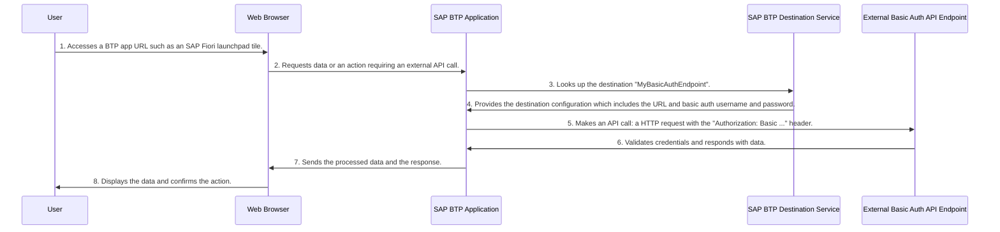

# Consuming and Validating SAP BTP Destinations to Support an OData XML Service

# Overview
SAP BTP destinations are used to connect to different services and systems in the cloud, on-premise or any publicly available endpoints. They are used to define the connection parameters for the service you want to consume. The destination is a logical representation of the service and contains all the information required to connect to it.

- This guide is focused on consuming OData XML services using SAP BTP destinations, when using [SAP Fiori tools](https://help.sap.com/docs/SAP_FIORI_tools) generator and [Service Centre](https://help.sap.com/docs/bas/sap-business-application-studio/explore-services-using-service-center) in SAP Business Application Studio.
- Other destination types are supported, for example, OData SAP HANA XS type services, but this guide is only focused on OData XML services.
- This guide uses a publicly available endpoint to demonstrate how to configure the SAP BTP destination and how to consume the OData XML service using the SAP Fiori tools generator with different configurations and tools.

# Prerequisites

- You have the SAP Cloud Foundry Runtime environment configured in your SAP BTP subaccount.
- You have admin rights to the SAP BTP cockpit to modify destinations.
- Only OData XML services are supported when creating SAP Fiori elements applications when using SAP Fiori tools generator.
- You have knowledge of [SAP BTP destinations](https://learning.sap.com/courses/operating-sap-business-technology-platform/using-destinations).
- You have knowledge of [SAP BTP destinations in the SAP BTP cockpit](https://developers.sap.com/tutorials/cp-cf-create-destination.html).

# Additional Resources
- [HTTP Destinations](https://help.sap.com/docs/connectivity/sap-btp-connectivity-cf/http-destinations)

## Flow Diagram

The following sequence diagram illustrates a typical flow of how a user accesses an SAP BTP application that consumes an external API endpoint. This application uses a destination configured with basic authentication.



# Sample Microsoft OData XML Service Endpoints

The endpoint `https://services.odata.org` exposes a number of OData service endpoints, as shown.

```
#1
https://services.odata.org/v2/northwind/northwind.svc/
#2
https://services.odata.org/V3/Northwind/Northwind.svc/
```

# Configuration 

This is a sample SAP BTP destination configuration for the Northwind OData service. The destination name is `northwind` and the URL is `https://services.odata.org`. The authentication type is set to `NoAuthentication`, and the proxy type is set to `Internet`.


The [SAP BTP destination configuration](northwind?raw=true) can be imported directly into your SAP BTP destinations list and it contains the following properties:

```
#
Type=HTTP
HTML5.DynamicDestination=true
Authentication=NoAuthentication
HTML5.Timeout=60000
WebIDEEnabled=true
ProxyType=Internet
URL=https\://services.odata.org
Name=northwind
WebIDEUsage=odata_gen
```

For more information about these properties, see [The Destination Is Mis-Configured](https://ga.support.sap.com/index.html#/tree/3046/actions/45995:48363:53594:54336).

# Summary of Properties
- `WebIDEUsage` is set to `odata_abap`. This means the destination is used for OData generation since it's exposing an OData XML service. There are many different values for this property such as `odata_cloud` which are used for different purposes.
-  When `WebIDEEnabled` is set to `true`, the destination is enabled for use in SAP Business Application Studio.
- `HTML5.Timeout` is set to 60000 ms. This is the length of time the destination waits for a response from the service before timing out.
- `HTML5.DynamicDestination` is set to `true`. This means that the destination is dynamically created at runtime, making it consumable by HTML5 and SAP Fiori applications at runtime, even if the destination does not exist in the subaccount.
- `Authentication` is set to `NoAuthentication`. This means that the destination does not require authentication. Endpoints that require authentication need to be configured with the appropriate authentication type, such as `BasicAuthentication` or `OAuth2ClientCredentials`, for example.
- Other properties can be added. Some of them are listed further in this 

# Understanding `WebIDEUsage`

The SAP BTP destination `WebIDEUsage` property is used to define the purpose of the destination. The following values are often used for this property: `dev_abap`, `ui5_execute_abap`, `bsp_execute_abap`, `odata_gen`, or `odata_abap`. For generating SAP Fiori elements applications using SAP Fiori tools, only `odata_abap` or `odata_gen` are required.

`odata_gen` and `odata_abap` are the most common values used for OData services and are mutually exclusive. Only specify the one that meets your requirements. For example, if you are using `odata_gen`, then the `odata_abap` must be removed and the other way around. The following table shows the common values for the `WebIDEUsage` property:

| Value        | Description                                                                                                   |
|--------------|---------------------------------------------------------------------------------------------------------------|
| `odata_gen`  | To consume a specific OData service of your choice. Used when the service endpoint is known to the user.                 |
| `odata_abap` | Consume the OData V2 and OData V4 service ABAP catalogs, which allows you to search for and select a specific OData service. |


# Understanding `WebIDEAdditionalData`
The `WebIDEAdditionalData` property (when set to `full_url`) is an optional configuration flag that instructs SAP tooling how to interpret the destination URL.

Specifically, it defines whether the destination URL represents the complete, final service URL, so no additional OData service paths are appended by SAP tooling. Alternatively, the destination URL is only a base host, and SAP tooling automatically appends the required OData service paths (such as `/sap/opu/odata/...` or `/odata/v2/...`), depending on the back end.

Example without `WebIDEAdditionalData`

The destination is treated as a base host, so SAP tooling appends service paths automatically:
```
https://api.successfactors.eu/odata/v2
```
Example with `WebIDEAdditionalData=full_url`

The destination is treated as a full URL, so SAP tooling does not append additional paths:
```
https://api.successfactors.eu/odata/v2/odata/v2/EmpJob
```

# Sample `curl` Commands for `odata_gen`

The `WebIDEUsage` property `odata_gen` allows you to control which __individual__ service you want to call. You can use the following `curl` commands to test your connection to the individual service:

In our sample Microsoft OData XML service endpoints above, the `northwind` endpoint exposes different OData XML services. 

The following `curl` commands are used to test these specific service endpoints:

__Note: These commands generate output files (`curl-datasrv-output.txt` and `curl-datasrv-meta-output.txt`) that contain the verbose output of the `curl` command, including headers and the response body.__

To call a known OData V2 service endpoint with a base path of `/v2/northwind` and an exposed service of `northwind.svc/`:
```bash
curl -L "https://northwind.dest/v2/northwind/northwind.svc/" -vs > curl-datasrv-output.txt 2>&1
```

To call a known OData V2 service endpoint with a `$metadata` query parameter:
```bash
curl -L "https://northwind.dest/v2/northwind/northwind.svc/\$metadata" -vs > curl-datasrv-meta-output.txt 2>&1
```

Since you are using `curl` from a terminal window, you need to escape the `$` sign with a backslash `\` to pass it as a query parameter. The above command returns the metadata of the specified OData service.

Note: `https://<destination-name>.dest/` is a placeholder that is appended with the name of your destination. It routes the HTTP request using the SAP Business Application Studio proxy and sets up the connection to your API back end.

The `northwind` destination is configured with the following URL property: `https://services.odata.org` so when the `curl` command is executed, it appends any path that is specified.

The `curl` command contains the service path: `/v2/northwind/northwind.svc/` which is appended to the SAP BTP destination URL: https://services.odata.org to form the complete URL: `https://services.odata.org/v2/northwind/northwind.svc/`. 

This also applies to the metadata query parameter. It is appended to the destination URL to form the complete URL: `https://services.odata.org/v2/northwind/northwind.svc/$metadata`. You can validate this externally from SAP BTP by opening a new browser tab and entering the complete URL to review the response.

# Sample `curl` Commands for `odata_abap`

Usually, your SAP BTP destination is configured with `odata_abap` to allow you to consume the OData V2 and V4 catalogs. You may only know the name of the service and not the specific service endpoint. The following `curl` commands are used to test the OData V2 and V4 catalogs:

__Note: These commands generate output files (`curl-v2catalog-output.txt` and `curl-v4catalog-output.txt`) that contain the verbose output of the `curl` command, including headers and response body.__

OData V2 Catalog

```bash
curl -L "https://<destination-name>.dest/sap/opu/odata/IWFND/CATALOGSERVICE;v=2/ServiceCollection" -vs > curl-v2catalog-output.txt 2>&1
```

OData V4 Catalog
```bash
curl -L "https://<destination_name>.dest/sap/opu/odata4/iwfnd/config/default/iwfnd/catalog/0002/ServiceGroups?\$expand=DefaultSystem(\$expand=Services)" -vs > curl-v4catalog-output.txt 2>&1
```

Note: Since you are using curl, you need to escape the `$` sign with a backslash `\` to pass it as a query parameter.

__Question__: Do you know why we can't use these OData V2 and OData V4 catalog endpoints against the `northwind` destination?

__Answer__: The `northwind` destination is not an ABAP system so the catalogs API endpoints are not available so it results in an HTTP 404 Not Found error.


# Environment Check

Environment check is a tool used to validate the destination configuration and ensure that all the required parameters are set correctly to allow you to use both Service Centre and SAP Fiori tools. The environment check also checks if the destination is reachable and if the catalogs are available.

Even if your destination is configured with `odata_gen`, it's still a valid tool to ensure that the destination is reachable and all the required parameters are set correctly. However, if your target system is not an ABAP system, then the OData V2 and OData V4 catalog endpoints fail.

1. Open SAP Business Application Studio.
1. Open the Command Palette (View -> Find Command).
1. Enter `Fiori: Open Environment Check`.
1. Click `Check Destination` and choose your destination.
1. Enter credentials, if prompted.
1. Click `Save and view results`.
1. A `Preview results.md` file opens. Review the `Destination Details` section for missing parameters.

For more information, see [Environment Check](https://help.sap.com/docs/SAP_FIORI_tools/17d50220bcd848aa854c9c182d65b699/75390cf5d81e43aea5db231ef4225268.html).

The file contains all the information required to troubleshoot the issue. You can read the file to gain a better understanding of how the destination is configured.

If you have an ongoing support ticket, attach the generated zip file to the ticket for further investigation. The entire zip file needs to be attached because it includes debug trace logs which help to determine connectivity issues and also provides a list of the services exposed by the destination.

# Common Errors

## Issue One 

__Issue: Receiving HTTP 4** Exceptions When Calling the Destination__

The URL property of a SAP BTP destination must only contain the base host and root service path.
If the URL is hardcoded with extra path segments, query parameters, or format options, the final request generated by SAP Fiori tools or the Service Center becomes invalid.

This typically leads to errors such as:

**HTTP 404 Not Found** (most common)

**HTTP 401/403** (when authentication is attempted against an invalid path)

## Example of an Incorrect Destination URL

If the destination URL is configured as shown in the following URL then SAP Fiori tools or the Service Center automatically appends the required service path for the operation:

```
https://services.odata.org/odata/$format=JSON
```

The final URL becomes:
```
https://services.odata.org/odata/$format=JSON/sap/opu/odata/IWFND/CATALOGSERVICE;v=2/ServiceCollection
```

This constructed URL is invalid because the destination already includes:

* A hardcoded query parameter: `/odata/$format=JSON`.
* No terminating service root.
* A path that does not match the expected OData structure.

As a result, all calls using this destination fail.

If you want to support a SAP BTP destination that exposes a hardcoded path to a specific OData service or resource. To do so, append a property to `Additional Properties` called `WebIDEAdditionalData` with a value such as `full_url`.

```
#
Type=HTTP
HTML5.DynamicDestination=true
Authentication=NoAuthentication
HTML5.Timeout=60000
WebIDEEnabled=true
ProxyType=Internet
WebIDEAdditionalData=full_url
URL=https\://services.odata.org/v2/northwind/northwind.svc/
Name=northwind_fullurl
WebIDEUsage=odata_gen
```

With this configuration, the destination URL is treated as a full URL, and no additional paths or parameters are appended by SAP Fiori tools or the Service Center.

To retrieve the OData service:
```bash
curl -L "https://northwind_fullurl.dest/" -vs > curl-fullurl-output.txt 2>&1
```

To retrieve the OData service `$metadata`:
```bash
curl -L "https://northwind_fullurl.dest/\$metadata" -vs > curl-fullurl-meta-output.txt 2>&1
```

## Issue Two

If you want to bypass SAP Business Application Studio to validate your SAP BTP destination properties and connectivity, you can use `Dynamic Destinations`. `Dynamic Destinations` are a way to validate your destination configuration outside of SAP Business Application Studio. This flow calls the SAP BTP destination directly from SAP Fiori launchpad.

__Ensure you are subscribed to [SAP Build Work Zone](https://developers.sap.com/tutorials/cp-portal-cloud-foundry-getting-started.html) to ensure the `dynamic_dest` path is exposed on your SAP BTP subaccount.__

1. Get the name of your SAP BTP subaccount destination configured using SAMLAssertion such as `mys4hc-destination`.
2. Ensure the SAP BTP destination `Additional Properties` contains `HTML5.DynamicDestination: true` and `WebIDEEnabled: true`.
3. Get the name of your `Subdomain` and `API endpoint` by opening your SAP BTP subaccount `overview` page, for example, the subdomain is `mytrial-account-staging` and API endpoint is `https://api.cf.eu10.hana.ondemand.com`.

Using the following template, replace the required parameters:

```
https://<your-subaccount-subdomain>.launchpad.cfapps.<your-region-api-endpoint>.hana.ondemand.com/dynamic_dest/<your-destination-name>/<path-to-your-OData-metadata-or-service-path>
```
For example, see the following base URL:
```json
https://mytrial-account.launchpad.cfapps.us10.hana.ondemand.com/dynamic_dest/mys4hc-destination/
```

Append the OData V2 catalog to the base URL:
```
https://mytrial-account.launchpad.cfapps.us10.hana.ondemand.com/dynamic_dest/mys4hc-destination/sap/opu/odata/IWFND/CATALOGSERVICE;v=2/ServiceCollection
```

Append the OData V4 catalog to the base URL:
```
https://mytrial-account.launchpad.cfapps.us10.hana.ondemand.com/dynamic_dest/mys4hc-destination/sap/opu/odata4/iwfnd/config/default/iwfnd/catalog/0002/ServiceGroups?$expand=DefaultSystem($expand=Services)
```

### License
Copyright (c) 2009-2025 SAP SE or an SAP affiliate company. This project is licensed under the Apache Software License, version 2.0 except as noted otherwise in the [LICENSE](../../LICENSES/Apache-2.0.txt) file.


