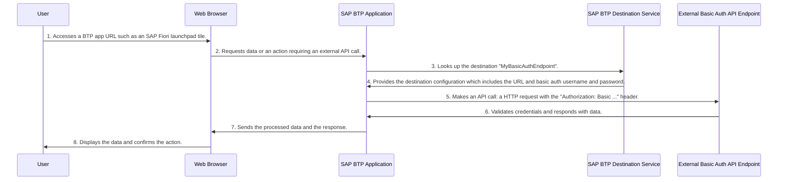

# Consuming and Validating SAP BTP Destinations to Support an OData XML Service

## Overview

SAP BTP destinations are used to connect to different services and systems in the cloud, on-premise, or any publicly available endpoints. They are used to define the connection parameters for the service you want to consume. The destination is a logical representation of the service and contains all the information required to connect to it.

When using `WebIDEUsage=odata_gen`, there are two ways to configure the destination URL:

- **Partial destination**: The destination URL contains only the base host (for example, `https://services.odata.org`). SAP tooling automatically appends the OData service path at runtime. Use this when your back-end exposes multiple services and you want to specify the service path during consumption.
- **Full destination**: The destination URL contains the complete path to a specific OData service (for example, `https://services.odata.org/v2/northwind/northwind.svc/`), indicated by setting `WebIDEAdditionalData=full_url`. SAP tooling uses the URL exactly as configured without appending any additional paths. Use this when you are targeting a single, fixed service endpoint.

When using `WebIDEUsage=odata_abap`, the partial/full distinction does not apply. The destination URL must always be the base host only, and SAP tooling appends the ABAP catalog paths automatically.

| | Partial Destination | Full Destination |
|---|---|---|
| **Applies to** | `odata_gen` only | `odata_gen` only |
| **URL contains** | Base host only | Complete service path |
| **`WebIDEAdditionalData`** | Not set | `full_url` |
| **Path handling** | SAP tooling appends service paths | URL used as-is |
| **Typical use case** | Back-end with multiple services | Third-party or single fixed-endpoint services |

- This guide is focused on consuming OData XML services using SAP BTP destinations, when using [SAP Fiori tools](https://help.sap.com/docs/SAP_FIORI_tools) generator and [Service Centre](https://help.sap.com/docs/bas/sap-business-application-studio/explore-services-using-service-center) in SAP Business Application Studio.
- Other destination types are supported, for example, OData SAP HANA XS type services, but this guide is only focused on OData XML services.
- This guide uses a publicly available endpoint to demonstrate how to configure the SAP BTP destination and how to consume the OData XML service using the SAP Fiori tools generator with different configurations and tools.

## Prerequisites

> **Important**: Ensure any HTML5 application source files you modify are under source control before making changes. Any configuration changes or scripts that alter system behaviour should be carried out with the authorization of your IT support team.

- You have the SAP Cloud Foundry Runtime environment configured in your SAP BTP subaccount.
- You have admin rights to the SAP BTP cockpit to modify destinations.
- Only OData XML services are supported when creating SAP Fiori elements applications when using SAP Fiori tools generator.
- You have knowledge of [SAP BTP destinations](https://learning.sap.com/courses/operating-sap-business-technology-platform/using-destinations).
- You have knowledge of [SAP BTP destinations in the SAP BTP cockpit](https://developers.sap.com/tutorials/cp-cf-create-destination.html).

## Additional Resources

- [HTTP Destinations](https://help.sap.com/docs/connectivity/sap-btp-connectivity-cf/http-destinations)
- [Testing SAP BTP Destinations with curl](curl-commands.md)

## Flow Diagram

The following sequence diagram illustrates a typical flow of how a user accesses an SAP BTP application that consumes an external API endpoint. This application uses a destination configured with basic authentication.


```mermaid
sequenceDiagram
    participant User
    participant Browser as Web Browser
    participant BTPApp as SAP BTP Application
    participant DestinationService as SAP BTP Destination Service
    participant ExternalAPI as External Basic Auth API Endpoint

    User->>Browser: 1. Accesses a BTP app URL such as an SAP Fiori launchpad tile.
    Browser->>BTPApp: 2. Requests data or an action requiring an external API call.
    BTPApp->>DestinationService: 3. Looks up the destination "MyBasicAuthEndpoint".
    DestinationService->>BTPApp: 4. Provides the destination configuration which includes the URL and basic auth username and password.
    BTPApp->>ExternalAPI: 5. Makes an API call: a HTTP request with the "Authorization: Basic ..." header.
    ExternalAPI->>BTPApp: 6. Validates credentials and responds with data.
    BTPApp->>Browser: 7. Sends the processed data and the response.
    Browser->>User: 8. Displays the data and confirms the action.
```

## Sample Microsoft OData XML Service Endpoints

The endpoint `https://services.odata.org` exposes a number of OData service endpoints, as shown.

```text
#V2
https://services.odata.org/v2/northwind/northwind.svc/
#V3
https://services.odata.org/V3/Northwind/Northwind.svc/
```

## Configuration

This is a sample SAP BTP destination configuration for the Northwind OData service. The destination name is `northwind` and the URL is `https://services.odata.org`. The authentication type is set to `NoAuthentication`, and the proxy type is set to `Internet`.


The [SAP BTP destination configuration](northwind?raw=true) can be imported directly into your SAP BTP destinations list and it contains the following properties:

```properties
#
Type=HTTP
HTML5.DynamicDestination=true
Authentication=NoAuthentication
HTML5.Timeout=60000
WebIDEEnabled=true
ProxyType=Internet
URL=https\://services.odata.org
Name=northwind
WebIDEUsage=odata_gen
```

For more information about these properties, see [The Destination Is Mis-Configured](https://ga.support.sap.com/index.html#/tree/3046/actions/45995:48363:53594:54336).

## Summary of Properties

- `WebIDEUsage` is set to `odata_gen`. This means the destination is used to consume OData services directly without calling catalog endpoints. The destination can be configured with either a complete service path (using `WebIDEAdditionalData=full_url`) or a partial service path. There are other values for this property such as `odata_abap` (for browsing service catalogs) or `odata_cloud` which are used for different purposes.
- When `WebIDEEnabled` is set to `true`, the destination is enabled for use in SAP Business Application Studio.
- `HTML5.Timeout` is set to 60000 ms. This is the length of time the destination waits for a response from the service before timing out.
- `HTML5.DynamicDestination` is set to `true`. This means that the destination is dynamically created at runtime, making it consumable by HTML5 and SAP Fiori applications at runtime, even if the destination does not exist in the subaccount.
- `Authentication` is set to `NoAuthentication`. This means that the destination does not require authentication. Endpoints that require authentication need to be configured with the appropriate authentication type, such as `BasicAuthentication` or `OAuth2ClientCredentials`, for example.
- Other properties can be added. Some of them are listed further in this document.

### Understanding `WebIDEUsage`

The SAP BTP destination `WebIDEUsage` property is used to define the purpose of the destination. The following values are often used for this property: `dev_abap`, `ui5_execute_abap`, `bsp_execute_abap`, `odata_gen`, or `odata_abap`. For generating SAP Fiori elements applications using SAP Fiori tools, only `odata_abap` or `odata_gen` are required.

`odata_gen` and `odata_abap` are the most common values used for OData services and are mutually exclusive. Only specify the one that meets your requirements. If both values are present, SAP Fiori tools defaults to `odata_abap`. The following table shows the common values for the `WebIDEUsage` property:

| Value        | Description                                                                                                                                                                                                                                                                                                     |
|--------------|-----------------------------------------------------------------------------------------------------------------------------------------------------------------------------------------------------------------------------------------------------------------------------------------------------------------|
| `odata_gen`  | Used when you want to consume OData services directly without calling catalog endpoints. The destination URL can point to either a complete service path (with `WebIDEAdditionalData=full_url`) or a partial service path where SAP tooling will append the specific service endpoint you provide during consumption. |
| `odata_abap` | Used to consume the OData V2 and OData V4 service ABAP catalogs, which allows you to browse, search for, and select a specific OData service from the available catalog.                                                                                                                                        |

### Understanding `WebIDEAdditionalData`

The `WebIDEAdditionalData` property is an optional configuration flag that instructs SAP tooling how to interpret the destination URL. It is only relevant when `WebIDEUsage=odata_gen`—it has no effect when using `odata_abap`, which always treats the destination URL as a base host.

When set to `full_url`, it tells SAP tooling that the destination URL represents the complete, final service URL, and no additional OData service paths should be appended. When this property is not set, SAP tooling treats the destination URL as a base host and automatically appends the required OData service paths (such as `/sap/opu/odata/...` or `/odata/v2/...`).

**Example without `WebIDEAdditionalData`:**

The destination is treated as a base host, so SAP tooling appends service paths automatically:

```text
https://api.successfactors.eu/odata/v2
```

**Example with `WebIDEAdditionalData=full_url`:**

The destination is treated as a full URL, so SAP tooling does not append additional paths:

```text
https://api.successfactors.eu/odata/v2/EmpJob
```

For detailed information about configuring and using `full_url`, see [Using `WebIDEAdditionalData=full_url` for Complete Service URLs](#using-webideadditionaldatafull_url-for-complete-service-urls).

## Authentication Types

The `Authentication` property in an SAP BTP destination controls how the destination service authenticates requests to the back-end system. The value you choose determines what credentials, if any, SAP BTP sends on behalf of the caller.

The most common authentication types for OData services are:

| Authentication Type | What SAP BTP sends | Typical use case |
|---|---|---|
| `NoAuthentication` | Nothing—no credentials attached | Public or open endpoints that do not require caller identity |
| `BasicAuthentication` | A fixed username and password | Systems that accept a shared technical user |
| `PrincipalPropagation` | A short-lived certificate representing the logged-in user | On-premise systems where end-user identity must be forwarded |
| `OAuth2ClientCredentials` | A client ID and secret exchanged for an access token | Cloud APIs using OAuth2 machine-to-machine flows |
| `SAMLAssertion` | A SAML assertion representing the logged-in user | Cloud systems requiring federated identity |

For a full list of supported authentication types, see [HTTP Destinations](https://help.sap.com/docs/connectivity/sap-btp-connectivity-cf/http-destinations).

### NoAuthentication

`Authentication=NoAuthentication` tells the SAP BTP destination service to forward requests to the back-end system without attaching any credentials. SAP BTP does not add an `Authorization` header, does not exchange tokens, and does not present certificates.

#### When to use NoAuthentication

Use `NoAuthentication` only for endpoints that are intentionally open and do not require caller identity, for example:

- Publicly available OData services (such as the Microsoft Northwind demo service).
- Internal sandbox or mock servers that do not enforce access control.
- Systems where access is controlled entirely at the network layer (for example, IP allowlisting, firewall rules, or VPN) rather than at the application layer.

#### When not to use NoAuthentication

Do not use `NoAuthentication` for:

- Any endpoint that returns user-specific or sensitive data.
- Systems where access should be restricted to authenticated users or specific technical accounts.
- Productive back-end systems: even if the back-end currently accepts unauthenticated requests, using `NoAuthentication` in production removes the ability to audit which caller made a request and makes it trivially easy for any authorized BTP user to query the service without restriction.

#### Security nuance

`NoAuthentication` means **SAP BTP sends no credentials**—it does not mean the back-end system is unprotected. The back-end may still enforce its own access controls:

- Network-level controls: IP allowlists, firewall rules, or Cloud Connector virtual host mappings that restrict which source IPs can reach the service.
- Application-level controls: The back-end system itself may still return HTTP 401 or HTTP 403 if it enforces its own access policy independent of the SAP BTP destination configuration.

If you are receiving unexpected HTTP 401 or HTTP 403 responses when using `NoAuthentication`, the back-end system is enforcing authentication independently of the destination configuration. Switch to the appropriate authentication type (`BasicAuthentication`, `OAuth2ClientCredentials`, or `PrincipalPropagation`) to supply credentials.

#### Destination configuration example

```ini
Type=HTTP
Authentication=NoAuthentication
ProxyType=Internet
URL=https://services.odata.org
Name=northwind
WebIDEEnabled=true
WebIDEUsage=odata_gen
HTML5.DynamicDestination=true
HTML5.Timeout=60000
```

For on-premise destinations using `ProxyType=OnPremise`, see [Choosing an Authentication Type](../onpremise/connectivity.md#choosing-an-authentication-type) for guidance on when `NoAuthentication` is and is not appropriate through the Cloud Connector.

## Using WebIDEAdditionalData=full_url for Complete Service URLs

### Overview

The `WebIDEAdditionalData=full_url` property is used when your destination URL contains the complete path to a specific OData service, including all path segments and service endpoints. When this property is set, SAP Fiori tools and Service Center will not append any additional paths to the URL.

### When to Use `full_url`

Use `WebIDEAdditionalData=full_url` when:

1. **Direct Service Access**: You want to point directly to a specific OData service endpoint without any path manipulation by SAP tooling.
2. **Fixed Service Paths**: The service URL includes non-standard paths or segments that must be preserved exactly as configured.
3. **Single Service Destinations**: You're creating a destination for one specific service rather than a system that exposes multiple services. For example, when a service is not listed in the OData V2 or V4 catalog, you can use `full_url` to point directly to the service endpoint.
4. **Third-Party Services**: You're consuming external OData services that don't follow SAP's standard path conventions.

### Configuration Example

Here's a sample destination configuration using `full_url`:

```properties
#
Type=HTTP
HTML5.DynamicDestination=true
Authentication=NoAuthentication
HTML5.Timeout=60000
WebIDEEnabled=true
ProxyType=Internet
WebIDEAdditionalData=full_url
URL=https\://services.odata.org/v2/northwind/northwind.svc/
Name=northwind_fullurl
WebIDEUsage=odata_gen
```

### Key Differences

| Property              | Without `full_url`                        | With `full_url`                                                                  |
|-----------------------|-------------------------------------------|----------------------------------------------------------------------------------|
| **URL Configuration** | Base host only: `https://services.odata.org` | Complete service path: `https://services.odata.org/v2/northwind/northwind.svc/` |
| **Path Handling**     | SAP tooling appends service paths automatically | URL is used exactly as configured                                                |
| **Usage Scenario**    | Multiple services or catalog browsing     | Single, specific service access                                                  |
| **Typical Use Case**  | SAP ABAP systems with catalog endpoints   | Third-party or fixed-endpoint services                                           |

### Testing with `curl`

When using a destination with `full_url`, the service path is already included in the destination URL so you do not need to append it in your `curl` commands. For full examples, see [Testing SAP BTP Destinations with curl](curl-commands.md#commands-for-odata_gen-destinations-full-url).

### Use Case Examples

#### Use case 1: Third-party OData service

You're consuming a specific OData service from an external provider with a fixed endpoint:

```properties
URL=https\://api.partner.com/services/v1/ProductCatalog.svc/
WebIDEAdditionalData=full_url
WebIDEUsage=odata_gen
```

#### Use case 2: Custom SAP Gateway service

You have a custom OData service deployed on SAP Gateway with a specific path that should not be modified:

```properties
URL=https\://gateway.example.com/sap/opu/odata/sap/ZCUSTOM_SRV/
WebIDEAdditionalData=full_url
WebIDEUsage=odata_gen
```

### Important Notes

- When using `full_url`, you cannot browse service catalogs because the URL points to a specific service endpoint, not a system's catalog API.
- The URL must end with a trailing slash (`/`) if it points to the service root.
- Always use `WebIDEUsage=odata_gen` with `full_url`, not `odata_abap`.
- Environment Check will report that catalog endpoints are unavailable, which is expected behavior when using `full_url`.

## Using `https://<destination-name>.dest/<service-path>` to Call a Service Directly

### Overview

When a destination is configured with `WebIDEUsage=odata_abap`, SAP tooling uses the ABAP service catalogs (OData V2 and OData V4) to discover available services. However, there are situations where a required service exists on the back-end system but is not listed in either catalog—for example, because it has not been registered in the catalog, has not been activated in `/IWFND/MAINT_SERVICE`, or requires a Communication Arrangement that has not been set up.

In these cases, you can bypass catalog discovery entirely and call the service directly by entering the `<destination-name>.dest` URL pattern in the SAP Fiori tools generator or Service Centre:

```text
https://<destination-name>.dest/<service-path>
```

The `.dest` suffix is resolved at runtime by the SAP BTP application router and the Destination Service. The destination name is substituted with the configured destination URL, and the service path is appended to form the complete back-end request.

### When to Use This Approach

Use the `<destination-name>.dest` URL pattern when:

- The destination uses `WebIDEUsage=odata_abap` but the required OData service is not visible in the V2 or V4 catalog.
- You know the exact service path on the back-end system.
- You want to avoid creating a separate `odata_gen` destination for a single service.
- The service is reachable through the existing destination (authentication and proxy settings are already correct).

This approach works with any destination proxy type—`Internet` or `OnPremise`—as long as the destination is reachable and the service path is accessible.

### Example: Northwind Destination

The following example demonstrates how to use this pattern with the `northwind` destination configured in the [Configuration](#configuration) section. The destination URL is `https://services.odata.org` and the required service path is `/V2/Northwind/Northwind.svc/`.

In the SAP Fiori tools generator, select **Connect to an OData Service** as the data source, then enter the full `.dest` URL in the **OData service URL** field:

```text
https://northwind.dest/V2/Northwind/Northwind.svc/
```

The following screenshot shows the generator with the URL entered. The warning beneath the field—"No backend annotations associated with this service were retrieved and may result in an invalid application being created"—is expected for services that do not expose OData annotations and does not prevent the application from being generated.


At runtime, the application router resolves `northwind.dest` to the configured destination URL (`https://services.odata.org`) and appends the service path, making the effective back-end request:

```text
https://services.odata.org/V2/Northwind/Northwind.svc/
```

### How the `.dest` URL Is Resolved

The following table summarizes how each part of the URL is handled:

| URL Segment | Example | Resolved By |
|---|---|---|
| `<destination-name>.dest` | `northwind.dest` | SAP BTP application router looks up the named destination from the Destination Service |
| `<service-path>` | `/V2/Northwind/Northwind.svc/` | Appended directly to the destination base URL at runtime |

### Important Notes

- The destination must have `HTML5.DynamicDestination=true` set so that the application router can resolve it at runtime.
- The service path you enter must match the exact path the back-end system exposes, including case sensitivity.
- If the service requires authentication, the destination's authentication configuration (for example, `BasicAuthentication`, `SAMLAssertion`, or `PrincipalPropagation`) is applied to the request automatically.
- This approach does not change how the destination is configured in the SAP BTP cockpit. The existing `odata_abap` destination is reused; you are simply addressing the service directly rather than going through catalog discovery.

### Cloning the Destination with `odata_gen`

If you prefer a more permanent solution, you can clone your existing `odata_abap` destination in the SAP BTP cockpit and update `WebIDEUsage` to `odata_gen`. This creates a dedicated destination that bypasses catalog discovery for all services, without affecting your original `odata_abap` destination.

1. In the SAP BTP cockpit, open your subaccount and navigate to **Connectivity** > **Destinations**.
2. Select your existing `odata_abap` destination and click **Clone**.
3. Give the cloned destination a new name (for example, `mys4hc-destination-gen`).
4. Change `WebIDEUsage` from `odata_abap` to `odata_gen`. Ensure `odata_abap` is fully removed: if both values are present, SAP Fiori tools defaults to `odata_abap` and catalog discovery is used instead.
5. Save the destination.

With `WebIDEUsage=odata_gen` and no `odata_abap` present, the SAP Fiori tools generator shows **Connect to a System** as the data source option. Selecting the destination exposes a **Service Path** field where you enter the service path directly. The following screenshot shows the `northwind` destination selected with an empty **Service Path** field ready for input:


Enter the service path in the **Service Path** field, for example:

```text
/V2/Northwind/Northwind.svc/
```

This approach is useful when multiple developers or multiple projects need to access the same service directly, so each user does not need to manually type the `.dest` URL each time.

## Sample `curl` Commands for `odata_gen`

When using `odata_gen`, the destination URL is the base host and you append the service path in your `curl` command. The `northwind` destination URL (`https://services.odata.org`) combined with the path `/v2/northwind/northwind.svc/` forms the complete back-end URL `https://services.odata.org/v2/northwind/northwind.svc/`. You can validate this externally from SAP BTP by opening a new browser tab and entering the complete URL to review the response.

For full `curl` examples including partial, full_url, and authentication variants, see [Testing SAP BTP Destinations with curl](curl-commands.md).

## Sample `curl` Commands for `odata_abap`

When using `odata_abap`, the destination URL is always the base host only — BAS appends the ABAP catalog paths automatically. Note that catalog endpoints are only available on ABAP systems. Calling them against a non-ABAP destination (such as the `northwind` destination) returns an HTTP 404 Not Found error, which is expected.

For full `curl` examples including V2/V4 catalog commands and authentication variants, see [Testing SAP BTP Destinations with curl](curl-commands.md).

## Environment Check

Environment check is a tool used to validate the destination configuration and ensure that all the required parameters are set correctly to allow you to use both Service Centre and SAP Fiori tools. The environment check also checks if the destination is reachable and if the catalogs are available.

Even if your destination is configured with `odata_gen`, it's still a valid tool to ensure that the destination is reachable and all the required parameters are set correctly. However, if your target system is not an ABAP system, then the OData V2 and OData V4 catalog endpoints fail.

1. Open SAP Business Application Studio.
1. Open the Command Palette (**View** > **Find Command**).
1. Enter `Fiori: Open Environment Check`.
1. Click `Check Destination` and choose your destination.
1. Enter credentials, if prompted.
1. Click `Save and view results`.
1. A `Preview results.md` file opens. Review the `Destination Details` section for missing parameters.

For more information, see [Environment Check](https://help.sap.com/docs/SAP_FIORI_tools/17d50220bcd848aa854c9c182d65b699/75390cf5d81e43aea5db231ef4225268.html).

**Note**: The Environment Check tool ignores destination properties such as `WebIDEUsage=odata_gen` and always attempts to call both the OData V2 and V4 catalog endpoints, regardless of the destination configuration. This is expected behavior and is used to validate that the destination is properly configured to access catalog services. If your destination uses `odata_gen` or points to a non-ABAP system, catalog endpoint failures in the report are normal and do not indicate a problem with your destination.

The file contains all the information required to troubleshoot the issue. You can read the file to gain a better understanding of how the destination is configured.

If you have an ongoing support ticket, attach the generated zip file to the ticket for further investigation. The entire zip file needs to be attached because it includes debug trace logs which help to determine connectivity issues and also provides a list of the services exposed by the destination.

## Common Errors

### Issue One: Receiving HTTP 4xx Exceptions

**Problem**: Receiving HTTP 4xx exceptions when calling the destination.

The URL property of a SAP BTP destination must only contain the base host and root service path.
If the URL is hardcoded with extra path segments, query parameters, or format options, the final request generated by SAP Fiori tools or the Service Center becomes invalid.

This typically leads to errors such as:

- **HTTP 404 Not Found** (most common)
- **HTTP 401 and HTTP 403** (when authentication is attempted against an invalid path)

#### Example of an incorrect destination URL

If the destination URL is configured as shown in the following URL then SAP Fiori tools or the Service Center automatically appends the required service path for the operation:

```text
https://services.odata.org/odata/$format=JSON
```

The final URL becomes:

```text
https://services.odata.org/odata/$format=JSON/sap/opu/odata/IWFND/CATALOGSERVICE;v=2/ServiceCollection
```

This constructed URL is invalid because the destination already includes:

- A hardcoded query parameter: `/odata/$format=JSON`.
- No terminating service root.
- A path that does not match the expected OData structure.

As a result, all calls using this destination fail.

**Solution**: If you need to use a complete service URL with specific paths or parameters, configure the destination with `WebIDEAdditionalData=full_url`. This tells SAP tooling to use the URL exactly as configured without appending additional paths. For detailed configuration examples and use cases, see [Using WebIDEAdditionalData=full_url for Complete Service URLs](#using-webideadditionaldatafull_url-for-complete-service-urls).

### Issue Two: Validating Destinations Using Dynamic Destinations

**Problem**: You want to bypass SAP Business Application Studio to validate your SAP BTP destination properties and connectivity directly.

You can use `Dynamic Destinations` to validate your destination configuration outside of SAP Business Application Studio. This approach calls the SAP BTP destination directly from SAP Fiori launchpad, allowing you to test connectivity independently.

**Ensure you are subscribed to [SAP Build Work Zone](https://developers.sap.com/tutorials/cp-portal-cloud-foundry-getting-started.html) to ensure the `dynamic_dest` path is exposed on your SAP BTP subaccount.**

#### Steps to use dynamic destinations

1. Get the name of your SAP BTP subaccount destination configured using SAMLAssertion such as `mys4hc-destination`.
2. Ensure the SAP BTP destination `Additional Properties` contains `HTML5.DynamicDestination: true` and `WebIDEEnabled: true`.
3. Get the name of your `Subdomain` and `API endpoint` by opening your SAP BTP subaccount `overview` page, for example, the subdomain is `mytrial-account-staging` and API endpoint is `https://api.cf.eu10.hana.ondemand.com`.

Using the following template, replace the required parameters:

```text
https://<your-subaccount-subdomain>.launchpad.cfapps.<your-region-api-endpoint>.hana.ondemand.com/dynamic_dest/<your-destination-name>/<path-to-your-OData-metadata-or-service-path>
```

For example, see the following base URL:

```text
https://mytrial-account.launchpad.cfapps.us10.hana.ondemand.com/dynamic_dest/mys4hc-destination/
```

Append the OData V2 catalog to the base URL:

```text
https://mytrial-account.launchpad.cfapps.us10.hana.ondemand.com/dynamic_dest/mys4hc-destination/sap/opu/odata/IWFND/CATALOGSERVICE;v=2/ServiceCollection
```

Append the OData V4 catalog to the base URL:

```text
https://mytrial-account.launchpad.cfapps.us10.hana.ondemand.com/dynamic_dest/mys4hc-destination/sap/opu/odata4/iwfnd/config/default/iwfnd/catalog/0002/ServiceGroups?$expand=DefaultSystem($expand=Services)
```

### Reporting Issues

When reporting issues or opening support tickets, you must provide diagnostic information to help support teams understand and resolve the issue. The artifacts you need to include depend on the destination configuration:

#### Option 1: Environment Check report

Run the Environment Check tool (as described in the [Environment Check](#environment-check) section above) and **review the generated output carefully**. The Environment Check report can reveal misconfigurations or issues with calling the respective catalog requests (OData V2/V4 catalogs), which may help you identify and resolve the problem without needing to open a support ticket.

When opening a support ticket, attach the generated zip file. This file includes:

- Destination configuration details
- Debug trace logs
- List of services exposed by the destination
- Connectivity test results

The entire zip file must be attached as it provides comprehensive information to diagnose connectivity and configuration issues.

#### Option 2: Network trace (HAR file)

Include a full network trace (`.har` file) with all requests in the scenario after it was reproduced. This is essential for support teams to understand the flow of API calls and identify the root cause of browser-based issues.

For information about how to extract the network trace, see [How to capture an HTTP trace using Google Chrome or MS Edge (Chromium)](<https://launchpad.support.sap.com/#/notes/1990706>).

The `.har` file should be exported from your browser (Chrome, Edge, Firefox, or Safari) and must include:

- All HTTP requests and responses during the issue reproduction
- Request and response headers
- Request and response payloads
- Timing information

This comprehensive trace allows support teams to analyze the complete flow of API calls, identify failed requests, and diagnose connectivity or configuration issues.

#### Option 3: On-premise destinations (ProxyType=OnPremise)

If your destination uses `ProxyType=OnPremise` (Cloud Connector), additional artifacts are required beyond the Environment Check report and HAR file. The Cloud Connector adds another layer between SAP BTP and your back-end system, requiring specific configuration details and logs for proper troubleshooting.

Review and follow the comprehensive [Checklist for Support Tickets](../onpremise/README.md#checklist-for-support-tickets) in the On-Premise guide, which includes:

- Screenshot of the destination in SAP BTP cockpit showing all properties
- Environment Check report
- Cloud Connector configuration screenshots:
  - Subaccount Overview
  - Virtual Host Mapping
  - Access Control settings
  - Check Availability results
- Cloud Connector trace logs (see [Enable Cloud Connector Trace Logging](../onpremise/README.md#enable-cloud-connector-trace-logging))
- ABAP transaction logs from `/IWFND/ERROR_LOG` and `/IWFND/GW_CLIENT` (if applicable)
- Output from `curl` connectivity tests

Compile all artifacts into a single zip file and attach it to your support ticket (component `BC-MID-SCC` for Cloud Connector or `CA-UX-IDE` for deployment issues).

**Note**: Always provide the Environment Check report. For internet-facing destinations, include the HAR file. For on-premise destinations, follow the complete [Cloud Connector checklist](../onpremise/README.md#checklist-for-support-tickets) to ensure all necessary diagnostic information is provided.

## License

Copyright (c) 2009-2026 SAP SE or an SAP affiliate company. This project is licensed under the Apache Software License, version 2.0 except as noted otherwise in the [LICENSE](../../LICENSES/Apache-2.0.txt) file.
