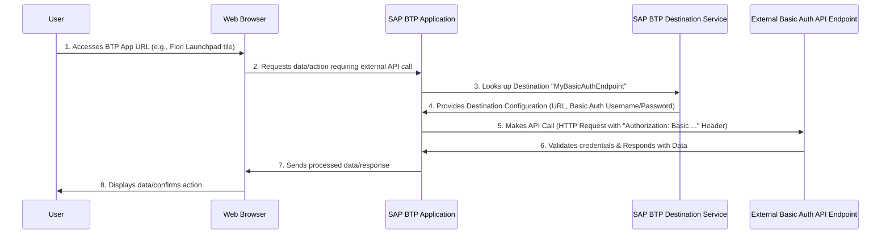

# Consuming and validating SAP BTP destinations to support OData XML Service

# Overview
SAP BTP destinations are used to connect to different services and systems in the cloud, On-Premise or any publicly available endpoints. They are used to define the connection parameters for the service you want to consume. The destination is a logical representation of the service and contains all the information required to connect to it.

- This guide is focused on consuming OData XML services via SAP BTP destinations, when using [SAP Fiori tools](https://help.sap.com/docs/SAP_FIORI_tools) generator and [Service Centre](https://help.sap.com/docs/bas/sap-business-application-studio/explore-services-using-service-center) in Business Application Studio (BAS).
- Other destination types are supported, for example, OData SAP HANA XS type services, but this guide is focused on OData XML service only.
- We are going to use a publicly available endpoint to demonstrate how to configure the SAP BTP destination and how to consume the OData XML service using the SAP Fiori tools generator using different configurations and tools.

# Prerequisites

- You have SAP Cloud Foundry Runtime environment configured in your SAP BTP subaccount
- You have admin rights to the SAP BTP cockpit to modify destinations
- Only OData XML services are supported when creating SAP Fiori Elements applications when using SAP Fiori tools generator
- Understanding [SAP BTP destinations](https://learning.sap.com/learning-journeys/administrating-sap-business-technology-platform/using-destinations)
- Creating [SAP BTP destinations in the SAP BTP cockpit](https://developers.sap.com/tutorials/cp-cf-create-destination..html)

# Additional Resources
- Understanding [SAP BTP destination authentication types](https://help.sap.com/docs/connectivity/sap-btp-connectivity-cf/http-destinations)

## Flow Diagram

The following sequence diagram illustrates a typical flow of how a user accesses an SAP BTP application that consumes an external API endpoint using a destination configured with Basic Authentication.



# Sample Microsoft OData XML service endpoints

The endpoint `https://services.odata.org` exposes a number of OData service endpoints, as shown.

```
#1
https://services.odata.org/v2/northwind/northwind.svc/
#2
https://services.odata.org/V3/Northwind/Northwind.svc/
```

# Configuration 

This is a sample SAP BTP destination configuration for the Northwind OData service. The destination name is `northwind` and the URL is `https://services.odata.org`. The authentication type is set to `NoAuthentication`, and the proxy type is set to `Internet`.


The [SAP BTP destination configuration](northwind?raw=true) can be imported directly into your SAP BTP destinations list and it contains the following properties;

```
#
Type=HTTP
HTML5.DynamicDestination=true
Authentication=NoAuthentication
HTML5.Timeout=60000
WebIDEEnabled=true
ProxyType=Internet
URL=https\://services.odata.org
Name=northwind
WebIDEUsage=odata_gen
```

For more information about these properties, see [The Destination Is Mis-Configured](https://ga.support.sap.com/index.html#/tree/3046/actions/45995:48363:53594:54336).

# Summary of Properties;
- `WebIDEUsage` is set to `odata_abap`. This means the destination is used for OData generation since it's exposing an OData XML service. There are many different values for this property such as `odata_cloud` which are used for different purposes.
-  When `WebIDEEnabled` is set to true, the destination is enabled for use in SAP Business Application Studio.
- `HTML5.Timeout` is set to 60000 ms. This is the time the destination will wait for a response from the service before timing out.
- `HTML5.DynamicDestination` is set to true. This means that the destination will be dynamically created at runtime, making it consumable by HTML5 applications at runtime, even if the destination does not exist in the subaccount.
- `Authentication` is set to `NoAuthentication`. This means that the destination does not require authentication.
- Other properties can be added. We will list some of them further on.

# Understanding `WebIDEUsage`

The SAP BTP destination `WebIDEUsage` property is used to define the purpose of the destination. The following are some of the common values for this property: `dev_abap`, `ui5_execute_abap`, `bsp_execute_abap`, `odata_gen`, `odata_abap`. In the context of using it for generating SAP Fiori Elements applications using SAP Fiori tools, `odata_abap` or `odata_gen` are only required.

`odata_gen` and `odata_abap` are the most common values used for OData services and are mutually exclusive. Only specify the one that meets your requirements. For example, if you are using `odata_gen`, then the `odata_abap` must be removed and the other way around. The following table shows the common values for the `WebIDEUsage` property:

| Value        | Description                                                                                                   |
|--------------|---------------------------------------------------------------------------------------------------------------|
| `odata_gen`  | To consume a specific OData service of your choice. Used when the service endpoint is known to the user.                 |
| `odata_abap` | Consume the V2 and V4 OData service ABAP catalogs, allowing you to search and select a specific OData service |


# Sample curl commands for `odata_gen`

The `WebIDEUsage` property `odata_gen` allows you to control which __individual__ service you want to call. You can use the following `curl` commands to test your connection to the individual service:

In our `Sample Microsoft OData XML service endpoints` above, the `northwind` endpoint exposes different OData XML services. 

The following curl commands are used to test these specific service endpoints:

Call a known V2 OData ervice endpoint, the base path is `/v2/northwind` and the service exposed is `northwind.svc/`
```bash
curl "https://dest.northwind/v2/northwind/northwind.svc/" -vs > curl-datasrv-output.txt 2>&1
```

Call a known service endpoint for V2 with `$metadata` query parameter
```bash
curl "https://dest.northwind/v2/northwind/northwind.svc/\$metadata" -vs > curl-datasrv-meta-output.txt 2>&1
```

Since you are using curl from a terminal window, you need to escape the `$` sign with a backslash `\` in order to pass it as a query parameter. The above command will return the metadata of the specified OData service.

Note: `https://dest.<destination-name>/` is a placeholder that is appended with the name of your destination, it routes the HTTP request via the BAS proxy and sets up the connection to your API backend.

Note: `https://dest.` can also be replaced with `$H2O_URL/destinations/<destination-name>/` for example.

Under the hood, the `northwind` destination is configured with the following URL property `https://services.odata.org` so when the curl command is executed, it will simply append any path that we have specified, for example;

The curl command contains the service path`/v2/northwind/northwind.svc/` which will be appended to the SAP BTP destination URL `https://services.odata.org` to form the complete URL `https://services.odata.org/v2/northwind/northwind.svc/`. The same applies to the metadata query parameter, it will be appended to the destination URL to form the complete URL `https://services.odata.org/v2/northwind/northwind.svc/$metadata`. You can validate external from SAP BTP, by opening a new browser tab and entering the complete URL to review the response.

# Sample curl commands for `odata_abap`

In most instances your SAP BTP destination will be configured with `odata_abap` to allow you to consume the OData V2 and V4 catalogs. You might only know the name of the service and not the specific service endpoint. The following curl commands are used to test the OData V2 and V4 catalogs:

OData V2 Catalog

```bash
curl "https://dest.<destination-name>/sap/opu/odata/IWFND/CATALOGSERVICE;v=2/ServiceCollection" -vs > curl-v2catalog-output.txt 2>&1
```

OData V4 Catalog
```bash
curl "https://dest.<destination_name>/sap/opu/odata4/iwfnd/config/default/iwfnd/catalog/0002/ServiceGroups?\$expand=DefaultSystem(\$expand=Services)" -vs > curl-v4catalog-output.txt 2>&1
```

Note: since you are using curl, you need to escape the `$` sign with a backslash `\` in order to pass it as a query parameter.

__Question__: Do you know why we can't use these V2 and V4 catalog endpoints against the `northwind` destination?

__Answer__: The `northwind` destination is not an ABAP system so the catalogs API endpoints are not available and will result in an HTTP 404 Not Found error

# Environment Check

Environment check is a tool used to validate the destination configuration and ensure that all the required parameters are set correctly to allow you to use both Service Centre and SAP Fiori tools. The environment check will also check if the destination is reachable and if the catalogs are available.

Even if your destination is configured with `odata_gen`, it's still a valid tool to run to ensure that the destination is reachable and all the required parameters are set correctly. However, if your target system is not an ABAP system, then the V2 and V4 catalog endpoints will fail, as expected.

1. Open SAP Business Application Studio.
1. Open the Command Palette (View -> Find Command).
1. Enter `Fiori: Open Environment Check`.
1. Select `Check Destination`, then choose your destination.
1. Enter credentials if prompted.
1. Select `Save and view results`.
1. A `Preview results.md` file will open—review the `Destination Details` section for missing parameters.

For more information https://help.sap.com/docs/SAP_FIORI_tools/17d50220bcd848aa854c9c182d65b699/75390cf5d81e43aea5db231ef4225268.html

The file contains all the information required to troubleshoot the issue and can be reviewed by the developer to get a better understanding of how the destination is configured.

If you have an ongoing support ticket, attach the generated zip file to the ticket for further investigation. The entire zip needs to be attached as it includes debug trace logs which help to determine connectivity issues and also provide a list of the services exposed by the destination.

# Troubleshooting

To complete this task, you need to ensure you are subscribed to `SAP Build Work Zone` which will then expose a SAP BTP path called `dynamic_dest`, allowing you to call the SAP BTP destination from outside of Business Application Studio and using the IdP you are logged in with.

This is a recommended flow to validate the destination configuration outside of Business Application Studio or SAP Build Work Zone 

1. In your SAP BTP Cockpit, select your subaccount `Overview` page, on the left navigation bar
1. Select the Overview page, note the `Subdomain` attribute i.e. my-subdomain and the `API endpoint region` i.e. `https://api.cf.eu10.hana.ondemand.com`, in this case the region will be `eu10`
1. Next, select `Destinations` under `Connectivity`
1. Filter the destinations using the name of your chosen destination
1. Select your destination i.e. `MyDestination`
1. Select `Edit`, ensure the following `Additional Properties` are configured;
    ```
    HTML5.DynamicDestination: true
    HTML5.Timeout: 60000
    WebIDEEnabled: true
    WebIDEUsage=odata_abap (Or replace with odata_gen if consuming a specific service)
    ```
1. Select `Save`, please ensure you have the client secret if required

Here is a sample URL, replace the <attribute> values with your own values;
```
https://<subdomain>.launchpad.cfapps.<region>.hana.ondemand.com/dynamic_dest/<your-destination-name>/<service-path>/<service-name>
```

Calling a known service path;
```
https://my-subdomain.launchpad.cfapps.eu10.hana.ondemand.com/dynamic_dest/MyDestination/sap/opu/odata/sap/MyBusinessService/$metadata
```

Calling V2 Catalog;
```
https://my-subdomain.launchpad.cfapps.eu10.hana.ondemand.com/dynamic_dest/MyDestination/sap/opu/odata/IWFND/CATALOGSERVICE;v=2/ServiceCollection
```

Open a new browser tab using the generated link to review the response, this should return a valid OData XML response.

# Common Errors

## Issue One 

__Issue: Getting HTTP 4** Exceptions When Calling the Destination__

The SAP BTP destination URL property, if hardcoded with additional properties, service paths or query parameters, will result in an HTTP 404 Not Found error. In some instances, this can also result in an HTTP 401/403 exception since you are calling an invalid service path.

Take, for example, a SAP BTP destination URL populated as follows;
```
https://services.odata.org/odata/$format=JSON
```

When the Service Centre or SAP Fiori tools initiate an HTTP request, any service path appended to the request will fail since the URL already contains a hardcoded value;

SAP BTP destination URL + Service path = Complete URL

So the complete URL will look like this when executed;
```
https://services.odata.org/odata/$format=JSON/sap/opu/odata/IWFND/CATALOGSERVICE;v=2/ServiceCollection
```

There are some instances where you want to support a SAP BTP destination that exposes a hardcoded path to a specific OData service or resource. To support this use case, append a property to `Additional Properties` called `WebIDEAdditionalData` with the value `full_url`, for example;

```
#
Type=HTTP
HTML5.DynamicDestination=true
Authentication=NoAuthentication
HTML5.Timeout=60000
WebIDEEnabled=true
ProxyType=Internet
WebIDEAdditionalData=full_url
URL=https\://services.odata.org/v2/northwind/northwind.svc/
Name=northwind_fullurl
WebIDEUsage=odata_gen
```

__Solution__

Ensure the SAP BTP destination URL only contains the base URL and not a hardcoded service path or query parameter.

You can validate this by executing the following curl commands;
To retrieve the OData service;
```bash
curl "https://dest.northwind_fullurl/" -vs > curl-fullurl-output.txt 2>&1
```
To retrieve the OData service `$metadata`;
```bash
curl "https://dest.northwind_fullurl/\$metadata" -vs > curl-fullurl-meta-output.txt 2>&1
```


### License
Copyright (c) 2009-2025 SAP SE or an SAP affiliate company. This project is licensed under the Apache Software License, version 2.0 except as noted otherwise in the [LICENSE](../../LICENSES/Apache-2.0.txt) file.


