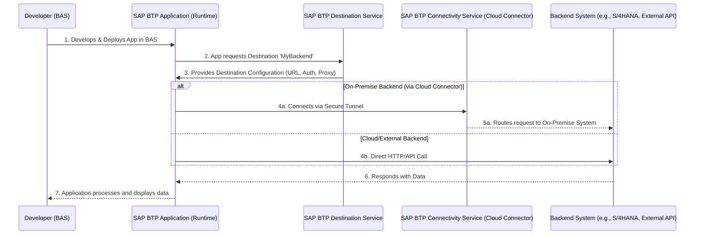

# SAP Cloud Connector (On-Premise) Destination

TL;DR: This guide explains how to configure an SAP BTP destination with proxy type `OnPremise` so BTP applications can securely reach on‑premise systems (for example, S/4HANA) via the SAP Cloud Connector. It includes configuration examples, validation steps, troubleshooting tips and a concise support-ticket checklist.

Table of contents
- [Overview](#overview)
- [Prerequisites](#prerequisites)
- [How it works (high level)](#how-it-works-high-level)
- [Flow diagram](#flow-diagram)
- [Configuration steps](#configuration-steps)
  - [Cloud Connector](#cloud-connector-configuration)
  - [SAP BTP Destination](#sap-btp-destination)
- [Validate connectivity](#validate-connectivity)
- [Connectivity issues & quick checks](#connectivity-issues--quick-checks)
- [Enable cloud connector trace logging](#enable-cloud-connector-trace-logging)
- [Additional resources](#additional-resources)
- [Support ticket checklist](#support-ticket-checklist)
- [Deployment issues](#deployment-issues)
- [Principal Propagation](#principal-propagation)
- [License](#license)

# Overview
An SAP BTP destination with `ProxyType=OnPremise` lets your cloud apps connect to on‑premise systems using the SAP Cloud Connector as a secure tunnel. Typical use cases:
1. Accessing on‑premise SAP systems (S/4HANA, ECC)
2. Connecting to internal databases or APIs behind a firewall
3. Consuming APIs that are not internet‑facing

Authentication options (typical):
- Basic Authentication
- OAuth2 — Client Credentials
- OAuth2 — User Credentials
- Principal Propagation (recommended for end‑user identity forwarding)

Security highlights:
- Encrypted communication between SAP BTP and on‑premise systems
- Support for principal propagation (end‑to‑end user identity)
- No need to expose internal services directly to the internet

# Prerequisites
- SAP BTP Cloud Foundry runtime configured in your subaccount.
- Admin access to the SAP BTP cockpit to create/modify destinations.
- Admin access to the SAP Cloud Connector UI for mapping and trace logs.
- Note: When generating SAP Fiori elements apps, ensure the OData services expose XML metadata (V2 or V4) as required by the generator.

## How it works (high level)
You create a Destination in your SAP BTP subaccount that points to a Cloud Connector mapping. At runtime, your app requests the destination configuration from the Destination Service. If the destination uses `OnPremise` proxy type, the request is routed through the Connectivity Service and the Cloud Connector to the on‑premise backend.

# Flow diagram
(If your renderer supports Mermaid this will render a sequence diagram showing BAS & BTP -> Destination Service -> Connectivity Service -> Backend)



# Configuration steps

## Cloud Connector configuration
For step‑by‑step Cloud Connector installation and configuration see: https://blogs.sap.com/2021/09/05/installation-and-configuration-of-sap-cloud-connector

## SAP BTP Destination
You can import the [Cloud Connector destination](./cloudconnector) example into the SAP BTP cockpit. Below is a concise example of typical destination properties (use the cockpit UI to create/update):

```ini
# SAP BTP Cloud Connector destination example
Type=HTTP
HTML5.DynamicDestination=true
Description=SAP Cloud Connector
Authentication=PrincipalPropagation
CloudConnectorLocationId=scloud
WebIDEEnabled=true
ProxyType=OnPremise
URL=http://my-internal-host:44330/
Name=MyOnPremiseDestination
WebIDEUsage=odata_abap
HTML5.Timeout=60000
```

Properties (quick notes):
- `WebIDEUsage=odata_abap` — expose OData service catalogs to SAP Business Application Studio.
- `WebIDEEnabled=true` — enable destination for BAS.
- `HTML5.Timeout` — timeout in milliseconds (example: 60000).
- `HTML5.DynamicDestination=true` — destination created dynamically at runtime when required.
- `Authentication=PrincipalPropagation` — forwards the end‑user identity to the backend (recommended for productive landscapes).
- `CloudConnectorLocationId` — the Cloud Connector location configured in the subaccount.
- `URL` — internal host/port mapped through the Cloud Connector; update to match your virtual host mapping.

# Validate connectivity

Run the Business Application Studio [Environment Check](../destinations/README.md#environment-check) to validate OData V2 and V4 catalog endpoints. The check produces an `envcheck-results.md` with details about any failures.

Address any issues found in the environment check report before proceeding.

# Connectivity issues & quick checks
If connectivity fails, run these quick checks first:
- Is the SAP Cloud Connector running and connected to the SAP BTP subaccount?
- Is the Cloud Connector mapping (virtual host/port and backend host/port) configured and active?
- Is the destination in the subaccount pointing to the correct `CloudConnectorLocationId` and name? Required if there are multiple Cloud Connectors.
- Are the authentication settings in the destination and backend system aligned (e.g., Principal Propagation, SSL Certs)?
- Are firewalls or proxies blocking traffic between Cloud Connector and the backend? Typical when moving to production as originating IPs change.
- Are you able to locally access the backend system directly from the Cloud Connector host (e.g., using `curl` or a web browser)?

If problems persist, follow the [trace logging](./README.md#enable-cloud-connector-trace-logging) steps below to gather logs and re-run the [Environment Check report](../destinations/README.md#environment-check).

# Enable cloud connector trace logging
Use trace logging only for troubleshooting (not recommended in production for long periods).

1. In the Cloud Connector UI: Log in -> `Log and Trace Files` -> `Edit`.
2. Set `Cloud Connector Loggers` to `ALL` and `Other Loggers` to `Information`.
3. Enable `Payload Trace` and ensure the correct subaccount is selected.
4. Reproduce the failing scenario and capture the following logs:
   - `ljs_trace.log` (SAP Cloud Connector)
   - `scc_core.log` (if present)
   - `traffic_trace_<subaccount>_on_<region>.trc` (required)
   - `tunnel_traffic_trace_<subaccount>_on_<region>.trc` (if applicable)
5. After capturing, revert logging levels to avoid excessive log generation.

For troubleshooting details see: https://help.sap.com/docs/connectivity/sap-btp-connectivity-cf/cloud-connector-troubleshooting

If you do not see network traffic in the `traffic_trace_` logs, the Cloud Connector is likely not establishing a secure tunnel to the target system — this is usually caused by a local firewall or proxy blocking the connection. For more information, see [Invalid proxy response status: 503 Service Unavailable](https://ga.support.sap.com/index.html#/tree/3046/actions/45995:48363:53594:63697:48366:52526).

# Additional resources
- Whitelisting [SAP BTP IP ranges](https://help.sap.com/docs/bas/sap-business-application-studio/sap-business-application-studio-availability?locale=en-US#inbound-ip-address%20), requires support from your IT Admin team.
- Understanding SAP BTP destinations: https://learning.sap.com/learning-journeys/administrating-sap-business-technology-platform/using-destinations
- Create SAP BTP destinations: https://developers.sap.com/tutorials/cp-cf-create-destination..html
- Cloud Connector explained: https://community.sap.com/t5/technology-blog-posts-by-sap/cloud-connector-explained-in-simple-terms/ba-p/13547036
- Principal Propagation [overview and setup links](#principal-propagation)
- Consuming SAPUI5 libraries from on‑premise: `./ui5-onpremise.md`

# Support ticket checklist
If you need to raise a support ticket (component `BC-MID-SCC` for Cloud Connector or `CA-UX-IDE` for deployment issues), attach the following items:

Required artifacts, compiled into a single zip file and attached to the support ticket:
1. Screenshot of the destination in the SAP BTP cockpit (show all properties)
2. [Environment Check report](../destinations/README.md#environment-check)
3. From your SAP Cloud Connector:
  - Subaccount Overview: SAP Cloud Connector -> Subaccount Overview -> Click Subaccount. 
  - Virtual Host Mapping: SAP Cloud Connector -> Cloud to On-Premise -> Select Virtual Host Mapping as defined in the SAP BTP destination. 
  - Access Control: SAP Cloud Connector -> Cloud to On-Premise -> Access Control -> Select Mapping -> Actions -> Edit (pencil icon). 
  - Access Control: SAP Cloud Connector -> Cloud to On-Premise -> Access Control -> Select Mapping -> Ensure "Access Policy" is set to "Path" and All Sub-Paths and URL Path is "/". Note this may differ depending on security concerns. 
  - Check Availability: SAP Cloud Connector -> Cloud to On-Premise -> Access Control -> Actions -> Select Mapping -> Check Availability.
  - Collected logs from trace logging (see list above)
4. Output from ABAP transaction logs `/IWFND/ERROR_LOG` and `/IWFND/GW_CLIENT`. For more information, see [SAP ABAP guide](https://www.youtube.com/watch?v=Tmb-O966GwM).

Optional but helpful:
- `curl` output from a BAS terminal when executing the connection test (see example below)
- Clear reproduction steps and expected vs actual behavior

Example connection test (BAS or any terminal window):

```bash
# Replace <destination-name> before executing
curl -vs -i -H "X-CSRF-Token: Fetch" "https://<destination-name>.dest/sap/opu/odata/IWFND/CATALOGSERVICE;v=2?saml2=disabled" > curl-catalog-output.txt 2>&1
```

You can review the generated `curl-catalog-output.txt` file to check for any errors or issues related to connectivity.

# Deployment issues

Before addressing any issues with deployment, ensure connectivity is working as per the [Validate connectivity](#validate-connectivity) section.

Common causes for deployment errors (HTTP 401/403):
- `/UI5/ABAP_REPOSITORY_SRV` not activated in the backend
- Missing required backend authorizations (e.g. `S_DEVELOP`)
- `HTML5.Timeout` too low in the destination (use `60000` ms or higher)
- Review ABAP traces `/IWFND/ERROR_LOG` and `/IWFND/GW_CLIENT` where applicable, will indicate missing authorizations or other issues.

For more information on deployment issues, see the SAP Guided Answers article: [Deployment to ABAP On-Premise System](https://ga.support.sap.com/index.html#/tree/3046/actions/45995:45996:50742:46000).

Quick steps to capture deployment debug info:
```bash
# Mac / Linux
DEBUG=* npm run deploy
# Windows (powershell)
set DEBUG=* && npm run deploy
```

Example connection test (BAS or any terminal window):

```bash
# Replace <destination-name> and <bsp-name> before executing
curl -vs -i -H "X-CSRF-Token: Fetch" "https://<destination-name>.dest/sap/opu/odata/UI5/ABAP_REPOSITORY_SRV/Repositories(%27<bsp-name>%27)?saml2=disabled" > curl-abap-srv-output.txt 2>&1
```
You can review the generated `curl-abap-srv-output.txt` file to check for any errors or issues related to the deployment process.

# Principal Propagation

In most on-premise configurations, Principal Propagation is the recommended implementation to support end-user identification. Principal Propagation is an authentication mechanism used primarily in SAP Cloud and hybrid system landscapes to securely forward (or propagate) a user’s identity from one system or layer to another without re-authenticating the user at each hop.

For example:
If a user logs into a SAP Fiori app on SAP BTP, and that app calls an on-premise SAP S/4HANA system, Principal Propagation allows the user’s identity to be sent end-to-end, so S/4HANA knows exactly which user made the request, rather than seeing a generic `technical` user.

1. [Setting up Principal Propagation](https://community.sap.com/t5/technology-blog-posts-by-sap/setting-up-principal-propagation/ba-p/13510251)
2. [Configuring Principal Propagation](https://help.sap.com/docs/connectivity/sap-btp-connectivity-cf/configuring-principal-propagation)

For more information about connectivity issues related to Principal Propagation configurations, see [How to troubleshoot SAP Cloud Connector principal propagation over HTTPS](https://help.sap.com/docs/SUPPORT_CONTENT/appservices/3361376259.html#HowtotroubleshootCloudConnectorprincipalpropagationoverHTTPS-Checkingthelogs,followtheclientcertificate).

# License
Copyright (c) 2009-2025 SAP SE or an SAP affiliate company.
This project is licensed under the Apache License 2.0. See [LICENSE](../../LICENSES/Apache-2.0.txt) for details.
