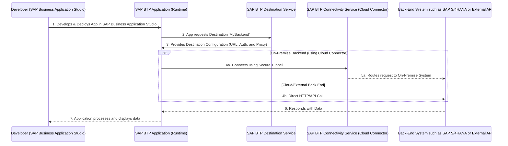

# Cloud Connector (On-Premise) Destination

This guide explains how to configure an SAP BTP destination with proxy type `OnPremise` so SAP BTP applications can securely reach on‑premise systems (such as SAP S/4HANA) using the Cloud Connector. It includes configuration examples, validation steps, troubleshooting tips, and a concise support-ticket checklist.

Table of contents
- [Overview](#overview)
- [Prerequisites](#prerequisites)
- [How It Works](#how-it-works-high-level)
- [Flow Diagram](#flow-diagram)
- [Configuration Steps](#configuration-steps)
  - [Cloud Connector](#cloud-connector-configuration)
  - [SAP BTP Destination](#sap-btp-destination)
- [Validate Connectivity](#validate-connectivity)
- [Connectivity Issues & Quick Checks](#connectivity-issues--quick-checks)
- [Enable Cloud Connector Trace Logging](#enable-cloud-connector-trace-logging)
- [Additional Resources](#additional-resources)
- [Support Ticket Checklist](#support-ticket-checklist)
- [Deployment Issues](#deployment-issues)
- [Principal Propagation](#principal-propagation)
- [License](#license)

# Overview
An SAP BTP destination with `ProxyType=OnPremise` lets your cloud apps connect to on‑premise systems using the Cloud Connector as a secure tunnel.

Use cases include:
- Accessing on‑premise SAP systems such as SAP S/4HANA and SAP ECC.
- Connecting to internal databases or APIs behind a firewall.
- Consuming APIs that are not internet‑facing.

Authentication options include:
- Basic Authentication
- OAuth2: Client Credentials
- OAuth2: User Credentials
- Principal Propagation: Recommended for end‑user identity forwarding.

Security benefits include:
- Encrypted communication between SAP BTP and on‑premise systems.
- Support for principal propagation (end‑to‑end user identity).
- No need to expose internal services directly to the internet.

# Prerequisites
- The SAP BTP Cloud Foundry runtime is configured in your subaccount.
- You have access to the SAP BTP cockpit to create and modify destinations.
- You have admin access to the Cloud Connector UI for mapping and trace logs.
- Note: When generating SAP Fiori elements apps, ensure the OData services expose XML metadata (OData V2 or OData V4) as required by the generator.

## How It Works
You create a destination in your SAP BTP subaccount that points to a Cloud Connector mapping. At runtime, your app requests the destination configuration from the destination service. If the destination uses the `OnPremise` proxy type, the request is routed through the Connectivity Service and the Cloud Connector to the on‑premise back-end.

# Flow Diagram
(If your renderer supports Mermaid, the code below renders a sequence diagram showing SAP Business Application Studio and SAP BTP -> Destination Service -> Connectivity Service -> Back End).



# Configuration Steps

## Cloud Connector Configuration
For more information about how to install and configure Cloud Connector, see [Installation and Configuration of SAP Cloud Connector](https://blogs.sap.com/2021/09/05/installation-and-configuration-of-sap-cloud-connector).

## SAP BTP Destination
You can import the [Cloud Connector destination](./cloudconnector) example into the SAP BTP cockpit. Below is an example of destination properties that you can use the SAP BTP cockpit to create and update:

```ini
# SAP BTP Cloud Connector Destination Example
Type=HTTP
HTML5.DynamicDestination=true
Description=SAP Cloud Connector
Authentication=PrincipalPropagation
CloudConnectorLocationId=scloud
WebIDEEnabled=true
ProxyType=OnPremise
URL=http://my-internal-host:44330/
Name=MyOnPremiseDestination
WebIDEUsage=odata_abap
HTML5.Timeout=60000
```

Properties:
- `WebIDEUsage=odata_abap` — Exposes OData service catalogs to SAP Business Application Studio.
- `WebIDEEnabled=true` — Enables the destination for SAP Business Application Studio.
- `HTML5.Timeout` — The timeout duration in milliseconds. Example: 60000.
- `HTML5.DynamicDestination=true` — Enables the destination to be dynamically created at runtime.
- `Authentication=PrincipalPropagation` — Forwards the end‑user identity to the back end. This is recommended for productive landscapes.
- `CloudConnectorLocationId` — The Cloud Connector location configured in the subaccount.
- `URL` — The internal host and port mapped through the Cloud Connector. Update this property to match your virtual host mapping.

# Validate Connectivity

Run the [Environment Check](../destinations/README.md#environment-check) in SAP Business Application Studio to validate the OData V2 and OData V4 catalog endpoints. The check produces an `envcheck-results.md` file with information about any failures.

Address any issues found in the environment check report before proceeding.

# Connectivity Issues & Quick Checks
If connectivity fails, run these quick checks first:
- Is the SAP Cloud Connector running and connected to the SAP BTP subaccount?
- Is the Cloud Connector mapping (virtual host and port and back-end host and port) configured and active?
- Is the destination in the subaccount pointing to the correct `CloudConnectorLocationId` and name? This is required if there are multiple Cloud Connectors.
- Are the authentication settings in the destination and back-end system aligned (such as principal propagation, SSL and certs)?
- Are firewalls or proxies blocking traffic between Cloud Connector and the back end? This often occurs when moving to production because the originating IPs change.
- Are you able to locally access the back-end system directly from the Cloud Connector host such as using `curl` or a web browser?

If problems persist, follow the [trace logging](./README.md#enable-cloud-connector-trace-logging) steps below to gather logs and re-run the [Environment Check report](../destinations/README.md#environment-check).

# Enable Cloud Connector Trace Logging
Only use trace logging for troubleshooting. This is not recommended in production in the long term.

1. In the Cloud Connector UI: Log in -> `Log and Trace Files` -> `Edit`.
2. Set `Cloud Connector Loggers` to `ALL` and `Other Loggers` to `Information`.
3. Enable `Payload Trace` and ensure the correct subaccount is selected.
4. Reproduce the failing scenario and capture the following logs:
   - `ljs_trace.log` (Cloud Connector)
   - `scc_core.log` (if present)
   - `traffic_trace_<subaccount>_on_<region>.trc` (required)
   - `tunnel_traffic_trace_<subaccount>_on_<region>.trc` (if applicable)
5. After capturing, revert logging levels to avoid excessive log generation.

For more information on troubleshooting, see [Monitoring, Logging, and Troubleshooting](https://help.sap.com/docs/connectivity/sap-btp-connectivity-cf/cloud-connector-troubleshooting).

If you do not see network traffic in the `traffic_trace_` logs, the most likely cause is that the Cloud Connector cannot establish a secure tunnel to the target system. This is often caused by a local firewall or proxy blocking the connection. For more information, see [Invalid proxy response status: 503 Service Unavailable](https://ga.support.sap.com/index.html#/tree/3046/actions/45995:48363:53594:63697:48366:52526).

# Additional Resources
- [Whitelisting SAP BTP IP ranges](https://help.sap.com/docs/bas/sap-business-application-studio/sap-business-application-studio-availability?locale=en-US#inbound-ip-address%20), requires support from your IT Admin team.
- [Understanding SAP BTP Destinations](https://learning.sap.com/learning-journeys/administrating-sap-business-technology-platform/using-destinations)
- [Create SAP BTP Destinations](https://developers.sap.com/tutorials/cp-cf-create-destination.html)
- [Cloud Connector Explained](https://community.sap.com/t5/technology-blog-posts-by-sap/cloud-connector-explained-in-simple-terms/ba-p/13547036)
- [Principal Propagation Overview and Setup Links](#principal-propagation)
- [Consuming SAPUI5 libraries from On‑Premise](./ui5-onpremise.md)

# Checklist for Support Tickets
If you need to raise a support ticket (component `BC-MID-SCC` for Cloud Connector or `CA-UX-IDE` for deployment issues), attach the following items:

The required artifacts, which should be compiled into a single zip file and attached to the support ticket, are:
- A screenshot of the destination in the SAP BTP cockpit (show all properties)
- [Environment Check report](../destinations/README.md#environment-check)
- From your Cloud Connector:
  - Subaccount Overview: Cloud Connector -> Subaccount Overview -> Click Subaccount. 
  - Virtual Host Mapping: Cloud Connector -> Cloud to On-Premise -> Select Virtual Host Mapping as defined in the SAP BTP destination. 
  - Access Control: Cloud Connector -> Cloud to On-Premise -> Access Control -> Select Mapping -> Actions -> Edit (pencil icon). 
  - Access Control: Cloud Connector -> Cloud to On-Premise -> Access Control -> Select Mapping -> Ensure "Access Policy" is set to "Path" and All Sub-Paths and URL Path is "/". Note this may differ depending on security concerns. 
  - Check Availability: Cloud Connector -> Cloud to On-Premise -> Access Control -> Actions -> Select Mapping -> Check Availability.
  - Collected logs from trace logging (see list above)
- Output from ABAP transaction logs `/IWFND/ERROR_LOG` and `/IWFND/GW_CLIENT`. For more information, see [SAP ABAP guide](https://www.youtube.com/watch?v=Tmb-O966GwM).

Optional but helpful:
- `curl` output from an SAP Business Application Studio terminal when executing the connection test. See the example below.
- Clear reproduction steps and expected versus actual behavior.

Example Connection Test (SAP Business Application Studio or any terminal window):

```bash
# Replace <destination-name> before executing
curl -L -vs -i -H "X-CSRF-Token: Fetch" "https://<destination-name>.dest/sap/opu/odata/IWFND/CATALOGSERVICE;v=2?saml2=disabled" > curl-catalog-output.txt 2>&1
```

You can review the generated `curl-catalog-output.txt` file to check for any errors or issues related to connectivity.

# Deployment Issues

Before addressing any issues with deployment, ensure connectivity is working as per the [Validate Connectivity](#validate-connectivity) section.

### Deployment Prerequisites
- Ensure that `/UI5/ABAP_REPOSITORY_SRV` has been activated in the back end.
- Missing required `S_DEVELOP` authorizations.
- For more information about `/UI5/ABAP_REPOSITORY_SRV` and fulfilling these prerequisites, see [Using an OData Service to Load Data to the SAPUI5 ABAP Repository](https://ui5.sap.com/#/topic/a883327a82ef4cc792f3c1e7b7a48de8).
  
### Debugging Deployment Errors (HTTP 401/403)
- Review ABAP transaction logs `/IWFND/ERROR_LOG` and `/IWFND/GW_CLIENT` where applicable. These logs indicate missing authorizations and other local issues.
- For more information on deployment issues, see [Deployment to ABAP On-Premise System](https://ga.support.sap.com/index.html#/tree/3046/actions/45995:45996:50742:46000).

Steps to capture deployment debug information:
```bash
# Mac / Linux
DEBUG=* npm run deploy
# Windows (powershell)
set DEBUG=* && npm run deploy
```

Example Connection Test (SAP Business Application Studio or any terminal window):

```bash
# Replace <destination-name> and <bsp-name> before executing
curl -L -vs -i -H "X-CSRF-Token: Fetch" "https://<destination-name>.dest/sap/opu/odata/UI5/ABAP_REPOSITORY_SRV/Repositories(%27<bsp-name>%27)?saml2=disabled" > curl-abap-srv-output.txt 2>&1
```
You can review the generated `curl-abap-srv-output.txt` file to check for any errors or issues related to the deployment process.

### Additional Resources
[Build and Deploy your SAPUI5 application using SAP Business Application Studio to ABAP repository (on-premise system)](https://community.sap.com/t5/technology-blog-posts-by-members/build-and-deploy-your-sapui5-application-using-sap-business-application/ba-p/13559538)   

# Principal Propagation

In most on-premise configurations, principal propagation is the recommended implementation to support end-user identification. Principal propagation is an authentication mechanism used primarily in SAP Cloud and hybrid system landscapes to securely forward (or propagate) a user's identity from one system or layer to another without re-authenticating the user at each hop.

For example:
If a user logs into a SAP Fiori app on SAP BTP, and that app calls an on-premise SAP S/4HANA system, principal propagation allows the user's identity to be sent end-to-end, so SAP S/4HANA knows exactly which user made the request, rather than seeing a generic `technical` user.

- [Setting up Principal Propagation](https://community.sap.com/t5/technology-blog-posts-by-sap/setting-up-principal-propagation/ba-p/13510251)
- [Configuring Principal Propagation](https://help.sap.com/docs/connectivity/sap-btp-connectivity-cf/configuring-principal-propagation)

For more information about connectivity issues related to principal propagation configurations, see [How to Troubleshoot Cloud Connector Principal Propagation over HTTPS](https://help.sap.com/docs/SUPPORT_CONTENT/appservices/3361376259.html#HowtotroubleshootCloudConnectorprincipalpropagationoverHTTPS-Checkingthelogs,followtheclientcertificate).

# License
Copyright (c) 2009-2025 SAP SE or an SAP affiliate company.
This project is licensed under the Apache License 2.0. See [LICENSE](../../LICENSES/Apache-2.0.txt) for details.
