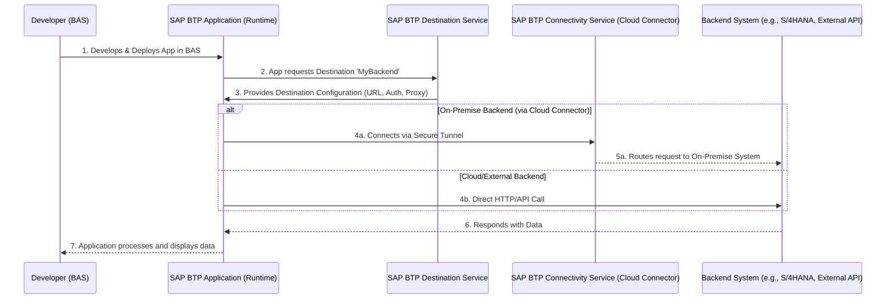

# SAP Cloud Connector (OnPremise) Destination

# Overview
An SAP BTP destination defined with Proxy type of `OnPremise` is a configuration that enables secure connectivity between your SAP Business Technology Platform (BTP) applications and on-premises systems residing behind your corporate firewall.

1. Use Cases include;
   1. Accessing on-premises SAP systems (S/4HANA, ECC, etc.)
   1. Connecting to internal databases residing in corporate networks
   1. Consuming APIs from services that aren't internet-facing
1. Authentication options include;
   1. Basic Authentication
   2. OAuth2 Client Credentials
   3. OAuth2 User Credentials
   4. Principal Propagation
1. Security Features include;
   1. Encrypted communication between SAP BTP and on-premises systems
   2. Supports principal propagation for identity forwarding
   3. No need to expose internal systems directly to the internet

# Prerequisites

- You have SAP Cloud Foundry Runtime environment configured in your SAP BTP subaccount
- You have admin rights to the SAP BTP cockpit to modify destinations
- You have admin rights to the SAP Cloud Connector (SCC) UI
- Only OData XML services are supported when creating SAP Fiori Elements applications when using SAP Fiori tools generator
- Understanding [SAP BTP destinations](https://learning.sap.com/learning-journeys/administrating-sap-business-technology-platform/using-destinations)
- Creating [SAP BTP destinations in the SAP BTP cockpit](https://developers.sap.com/tutorials/cp-cf-create-destination..html)


## Understanding SAP Cloud Connector and SAP BTP Destinations

When you build applications on SAP BTP, especially those that need to connect to backend systems (like S/4HANA, other cloud services, or external APIs), you generally don't hardcode connection details. Instead, you define **Destinations** in your SAP BTP subaccount. These destinations centralize connection information (URL, authentication, proxy settings, etc.).

Business Application Studio (BAS) is your development environment. When you develop an application in BAS that will run on BTP, you configure it to consume these destinations. At runtime, the BTP application looks up the destination by name, retrieves the necessary connection details from the SAP BTP Destination Service, and then establishes the connection to the backend system.

## Flow Diagram

The following Mermaid diagram illustrates this process, assuming the default IdP is used for authentication, which is the SAP BTP Identity Provider (IdP) configured in your subaccount. 



# Configuration Steps

## SAP Cloud Connector Configuration

This guide will not document the steps to configure an SAP Cloud Connector, the following blog post details [Installation and Configuration of SAP Cloud Connector](https://blogs.sap.com/2021/09/05/installation-and-configuration-of-sap-cloud-connector).

## SAP BTP Destination

To get a better understanding of SAP BTP destinations, refer to the guide [Consuming and validating SAP BTP destinations to support OData XML Service](../destinations/README.md).

The [SAP BTP Cloud Connector destination configuration](cloudconnector?raw=true) can be imported directly into your SAP BTP destinations list and it contains the following properties;

```text
#
Type=HTTP
HTML5.DynamicDestination=true
Description=SAP Cloud Connector
Authentication=PrincipalPropagation
CloudConnectorLocationId=scloud
WebIDEEnabled=true
ProxyType=OnPremise
URL=http\://my-internal-host\:44330/
Name=cloudconnector
WebIDEUsage=odata_abap
```

Quick Summary of the properties;
- `WebIDEUsage` is configured with `odata_abap`, this means that the destination is used to expose OData service catalogs to the SAP Business Application Studio
- `WebIDEEnabled` is set to true; this means that the destination is enabled for use in the SAP Business Application Studio
- `HTML5.Timeout` is set to 60000 ms; this is the time the destination will wait for a response from the service before timing out
- `HTML5.DynamicDestination` is set to true; this means that the destination will be dynamically created at runtime
- `Authentication` is set to `PrincipalPropagation`, this means that the destination to support a productive landscape, to maintain the same user context and to avoid the need for a password
- `CloudConnectorLocationId` is set to `scloud`, this is the location ID of the SAP Cloud Connector that is configured in the SAP BTP cockpit, SAP BTP subaccount can be configured with different Cloud Connectors
- `URL` is set to `http://my-internal-host:44330/` which indicates the internal URL that is then mapped to your on-premise system within your local onpremise network. Note, the URL will always default to `http://` soo only the port and address are configurable.

# Validate Connectivity

To validate your SAP BTP destination connectivity, run the [Environment Check](../destinations/README.md#environment-check) and review the generated results.

# Connectivity Issues

If you are experiencing connectivity issues, please check the following;

### Common Issues

This [guide](https://ga.support.sap.com/dtp/viewer/index.html#/tree/3046/actions/45995:48363:53594:48366:52526) covers some of the most common issues encountered when using SCC and SAP BTP destinations. If you make changes to your configuration, please re-run your existing steps to see if the issue is resolved.

- Ensure that the SCC is running and that the connection to the on-premise system is established, you can review the SCC logs for any errors, see next section
- Ensure there are no issues with firewalls blocking incoming connections from SAP BTP, in some cases, you may need to whitelist the IP addresses of the SAP BTP data centers
- Ensure there are no issues with SSL certificates, you can review the SCC `core` or `ljs` logs for any errors, see next section

### Enable Trace Logging

Step 1. Enable logging in the SAP Cloud Connector (SCC) UI

* Confirm the version of your SAP Cloud Connector (SCC).
* Set Cloud Connector Loggers to ALL
* Set Other Loggers to Information
* Enable Payload Trace (ensure the correct subaccount is selected)
  Replicate the issue and provide us with the following logs, if generated:
* ljs_trace.log (Cloud Connector).
* scc_core.log (if applicable, newer version).
* traffic_trace_<subaccount>_on_<region>.trc.
* tunnel_traffic_trace_<subaccount>_on_<region>.trc (if applicable, newer version).

__Note:__ As best practice, we recommend that you do not enable trace logging in production environments unless you are troubleshooting a specific issue.

Step 2. Next, run the scenario that is failing and check the logs for any errors or else run Environment Check to call the V2 and V4 catalog API endpoints. The logs will provide detailed information about the requests and responses between the SAP BTP and the on-premise system.

Step 3. Once you've gathered the logs, you can disable the trace settings.

For more details on these logs, please refer to SAP Cloud Connector Troubleshooting https://help.sap.com/docs/connectivity/sap-btp-connectivity-cf/cloud-connector-troubleshooting.

Step 4. Review the logs for any errors or issues. The logs will provide detailed information about the requests and responses between the SAP BTP and the on-premise system.

If you are not seeing any network traffic in the `traffic_trace_` logs, then the issues are most likely with the SCC configuration where the SAP Cloud Connector is unable to establish a secure connection to the target ABAP system which is blocking traffic.

# Additional Resources

Cloud Connector, explained in simple terms - https://community.sap.com/t5/technology-blog-posts-by-sap/cloud-connector-explained-in-simple-terms/ba-p/13547036

Installation and Configuration of SAP Cloud Connector, https://blogs.sap.com/2021/09/05/installation-and-configuration-of-sap-cloud-connector which provides a step-by-step guide to configuring SAP Cloud Connector.

Principal Propagation Configuration;
1. Blog post https://blogs.sap.com/2021/09/06/setting-up-principal-propagation
2. SAP Help Portal https://help.sap.com/docs/connectivity/sap-btp-connectivity-cf/configuring-principal-propagation
3. Check Logs https://help.sap.com/docs/SUPPORT_CONTENT/appservices/3361376259.html?locale=en-US&state=PRODUCTION&version=1.0#HowtotroubleshootCloudConnectorprincipalpropagationoverHTTPS-Checkingthelogs,followtheclientcertificate

[Consuming SAPUI5 Libraries from an On-Premise System](./ui5-onpremise.md) provides a step-by-step guide to consuming SAPUI5 libraries from an On-Premise system using SAP Cloud Connector and a SAP BTP destination.

# Support Ticket

If you are still experiencing issues, please raise a support ticket using the support component `BC-MID-SCC` and ensure you provide the following information;

## Step 1. Screenshots Required

Navigate to SAP BTP -> Subaccount -> Connectivity -> Destinations. Select the affected destination and ensure all properties are shown.

From your SAP Cloud Connector (SCC):
* Subaccount Overview: SCC -> Subaccount Overview -> Click Subaccount.
* Virtual Host Mapping: SCC -> Cloud to On-Premise -> Select Virtual Host Mapping as defined in SAP BTP Destination.
* Access Control: SCC -> Cloud to On-Premise -> Access Control -> Select Mapping -> Actions -> Edit (pencil icon).
* Access Control: SCC -> Cloud to On-Premise -> Access Control -> Select Mapping -> Ensure Access Policy is set to Path and All Sub-Paths and URL Path is / (this might differ depending on security concerns)
* Check Availability: SCC -> Cloud to On-Premise -> Access Control -> Actions -> Select Mapping -> Check Availability.

## Step 2. Trace SAP Cloud Connector Activity

* Confirm the version of your SAP Cloud Connector
* Set Cloud Connector Loggers to ALL
* Set Other Loggers to Information
* Enable Payload Trace (ensure the correct subaccount is selected)
  Replicate the issue and provide us with the following logs, if generated:
* ljs_trace.log (Cloud Connector).
* scc_core.log (if applicable, newer version).
* traffic_trace_<subaccount>_on_<region>.trc.
* tunnel_traffic_trace_<subaccount>_on_<region>.trc (if applicable, newer version).

Also, specify the date and time of the request to help us narrow down the logs.

Once you've gathered the logs, you can disable the trace settings.

## Step 3. Environment Check Report
Run the [Environment Check Report](../destinations/README.md#environment-check) and attach the generated zip file.

## Step 4. Archive Files

Please compress all the requested files into a single zip file and attach it to the support ticket for easier review.

# Deployment Issues

If you are experiencing deployment issues, please refer to the [Deployment Issues](https://ga.support.sap.com/index.html#/tree/3046/actions/45995:45996:50742:46000) guide for troubleshooting steps. 

In most instances, the root cause of deployment issues relates to the prerequisites not being met.

### Option 1. ABAP Transaction Log

If connectivity to the ABAP system is working but API requests are failing, check the ABAP transaction logs:

Use `/IWFND/ERROR_LOG` to view OData service errors.

Use `/IWFND/GW_CLIENT` to test and analyze service calls.

Refer [SAP ABAP guide](https://www.youtube.com/watch?v=Tmb-O966GwM)

### Option 2. Enable Trace Logging

Run the following deployment command with debug logging enabled to get more information about the API request and response. This will help identify any issues during the deployment process.

```bash
# Mac or Linux
DEBUG=* npm run deploy
# Windows
set DEBUG=* && npm run deploy
````
To make it a permanent change, in your HTML5 application, you can add `--verbose` to enable trace logging to get more information about the API request and response.

```json
"deploy": "npm run build && fiori deploy --config ui5-deploy.yaml --verbose && rimraf archive.zip"
```

Re-run the deployment command `npm run deploy` and check the console output for any errors or issues. The trace logging will provide detailed information about the requests and responses between the SAP BTP and the on-premise system.

### Option 3. Execute Connectivity Test using Business Application Studio (BAS)
- Open a BAS terminal window and run the following command to execute the connectivity test;
Replace `<destination-name>` with the name of your SAP BTP destination.
Replace `<bsp-name>` with the name of your BSP name.
```bash
curl -vs -i -H "X-CSRF-Token: Fetch" "https://dest.<destination-name>/sap/opu/odata/UI5/ABAP_REPOSITORY_SRV/Repositories(%27<bsp-name>%27)?saml2=disabled"  > curl-abap-srv-output.txt 2>&1
```
- Review the `curl-abap-srv-output.txt` file for any errors or issues. In some instances, the root cause of why the API request is failing can be found in the response body or headers.

Please note, if you get an HTTP 404 error, this means that the BSP application is not yet deployed but indicates there is no connectivity issue to your OnPremise ABAP system.


