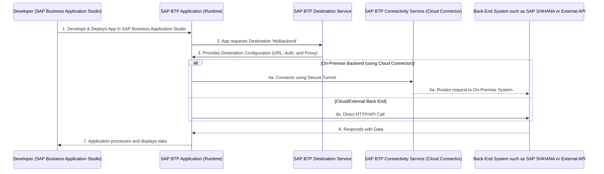

# Cloud Connector (On-Premise) Destination

This guide explains how to configure an SAP BTP destination with proxy type `OnPremise` so SAP BTP applications can securely reach on-premise systems (such as SAP S/4HANA) using the Cloud Connector.

> **Important:** Ensure any HTML5 application source files you modify are under source control before making changes. Any configuration changes or scripts that alter the behaviour of your system should be carried out with the authorization of your IT support team.

Table of Contents

- [Overview](#overview)
- [Prerequisites](#prerequisites)
- [How It Works](#how-it-works)
- [Flow Diagram](#flow-diagram)
- [Guide](#guide)

---

## Overview

An SAP BTP destination with `ProxyType=OnPremise` lets your cloud apps connect to on-premise systems using the Cloud Connector as a secure tunnel.

Use cases include:

- Accessing on-premise SAP systems such as SAP S/4HANA and SAP ECC.
- Connecting to internal databases or APIs behind a firewall.
- Consuming APIs that are not internet-facing.

Authentication options include:

- Basic Authentication
- OAuth2: Client Credentials
- OAuth2: User Credentials
- Principal Propagation: Recommended for end-user identity forwarding.

Security benefits include:

- Encrypted communication between SAP BTP and on-premise systems.
- Support for principal propagation (end-to-end user identity).
- No need to expose internal services directly to the internet.

---

## Prerequisites

- SAP BTP Cloud Foundry runtime is configured in your subaccount.
- You have access to the SAP BTP cockpit to create and modify destinations.
- You have admin access to the Cloud Connector UI for mapping and trace logs.
- When generating SAP Fiori elements apps, ensure the OData services expose XML metadata (OData V2 or OData V4) as required by the generator.

---

## How It Works

You create a destination in your SAP BTP subaccount that points to a Cloud Connector mapping. At runtime, your app requests the destination configuration from the destination service. If the destination uses the `OnPremise` proxy type, the request is routed through the Connectivity Service and the Cloud Connector to the on-premise back end.

---

## Flow Diagram

(If your renderer supports Mermaid, the code below renders a sequence diagram.)

```mermaid
sequenceDiagram
   participant Developer as Developer (SAP Business Application Studio)
   participant BTPApp as SAP BTP Application (Runtime)
   participant DestinationService as SAP BTP Destination Service
   participant ConnectivityService as SAP BTP Connectivity Service (Cloud Connector)
   participant BackendSystem as Back-End System such as SAP S/4HANA or External API

   Developer->>BTPApp: 1. Develops & Deploys App in SAP Business Application Studio
   BTPApp->>DestinationService: 2. App requests Destination 'MyBackend'
   DestinationService->>BTPApp: 3. Provides Destination Configuration (URL, Auth, and Proxy)

   alt On-Premise Backend (using Cloud Connector)
      BTPApp->>ConnectivityService: 4a. Connects using Secure Tunnel
      ConnectivityService-->>BackendSystem: 5a. Routes request to On-Premise System
   else Cloud/External Back End
      BTPApp->>BackendSystem: 4b. Direct HTTP/API Call
   end

   BackendSystem-->>BTPApp: 6. Responds with Data
   BTPApp-->>Developer: 7. Application processes and displays data
```

---

## Guide

Work through the sections in order. Each page links to the next.

| Step | Page | What it covers |
|---|---|---|
| 1 | [Connectivity](./connectivity.md) | Configure the Cloud Connector and BTP destination, validate the back end is reachable, and resolve connectivity failures. |
| 2 | [Deployment](./deployment.md) | Deploy your SAP Fiori app to the ABAP on-premise repository and resolve deployment errors. |
| 3 | [Principal Propagation](./principal-propagation.md) | Configure end-user identity forwarding from SAP BTP through the Cloud Connector to the back end. |
| 4 | [SAPUI5 Library from On-Premise](./ui5-onpremise.md) | Consume a pinned SAPUI5 version served from your on-premise system instead of the CDN. |

**Raising a ticket?** See the [Support Checklist](./support-checklist.md) for the artifacts to attach.

---

## License

Copyright (c) 2009-2026 SAP SE or an SAP affiliate company.
This project is licensed under the Apache License 2.0. See [LICENSE](../../LICENSES/Apache-2.0.txt) for details.
