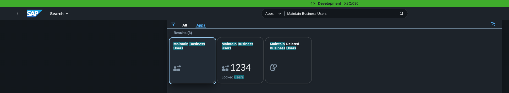
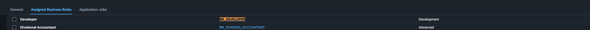
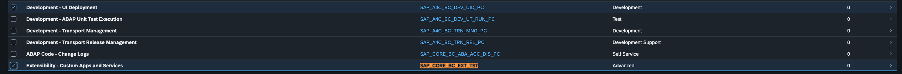
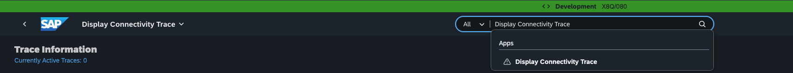
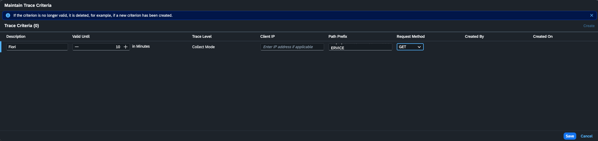
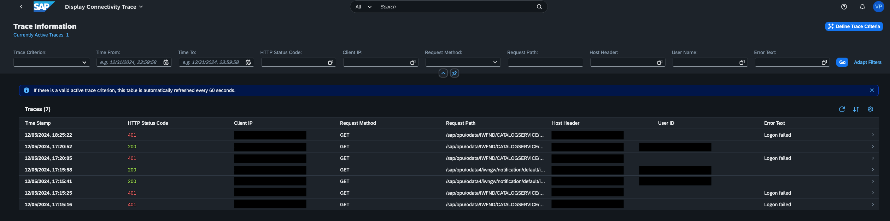

# SAMLAssertion destination configured to point SAP S/4HANA Cloud Public tenant

# Prerequisites
1. Steps 1, 2, and Step 3 from https://developers.sap.com/tutorials/abap-custom-ui-bas-connect-s4hc.html are completed.
2. You have administrative access to your SAP S/4HANA Cloud system so you can configure and debug connectivity issues.
3. You are subscribed to SAP Business Application Studio. For more information, see [Subscribe to Business Application Studio](https://help.sap.com/docs/SAP%20Business%20Application%20Studio/9d1db9835307451daa8c930fbd9ab264/6331319fd9ea4f0ea5331e21df329539.html).
4. You have reviewed [SAP S/4HANA Cloud, Public Edition FAQ](https://me.sap.com/notes/3445942).
5. You have reviewed the [SAP Business Application Studio Integration with SAP S/4HANA Cloud](https://me.sap.com/notes/3297481) documentation

## Create a SAP BTP SAMLAssertion Destination to consume V2 and V4 OData Catalogs
1. Open the [s4hana-cloud_saml](s4hana-cloud_saml) file using a text editor or browser.
2. Replace all instances of `my1111111` with your specific hostname.
3. Log in to your SAP BTP subaccount, select the `Destinations` tab, and select `Import Destination`.
4. Log in to SAP Business Application Studio to consume the new destination to validate that the connection works.

For more information, see [Create a Destination to Connect to SAP Business Application Studio](https://help.sap.com/docs/SAP_S4HANA_CLOUD/0f69f8fb28ac4bf48d2b57b9637e81fa/31876c06f99645f289d802f9c95fb62b.html).

## How SAMLAssertion Works

1. SAP BTP, typically configured with a local SAML Identity Providers (IdP), sends a SAML Assertion (including the SAML Issuer and signature) to SAP S/4HANA Cloud, Public Edition (SAML SP).
1. The Communication System on SAP S/4HANA Cloud validates the SAML Issuer and signature.
1. It then maps the user ID and ID format.
1. The user with the same subject ID must exist in both the SAP S/4HANA Cloud and SAP BTP systems.

### NameID Format in SAP BTP Destination
In your SAP BTP destination, the `nameIdFormat` property affects the behavior of user ID mapping against your SAP S/4HANA Cloud instance
* `urn:oasis:names:tc:SAML:1.1:nameid-format:emailAddress` - User ID maps to the email address
* `urn:oasis:names:tc:SAML:1.1:nameid-format:unspecified` - User ID maps to the username

Unless you have a specific technical reason, the default should be `urn:oasis:names:tc:SAML:1.1:nameid-format:emailAddress` as the `nameIdFormat`. The email address as defined in your IdP i.e OpenID Connect or IAS must match the S4HC email address configured with the appropriate roles. Please refer to the related links section below to understand more around adding other IdP's to your SAB BTP system.

## Authorization Requirements
Different authorizations are required for various operations in SAP S/4HANA Cloud, such as:

* Accessing catalog services to browse available OData Services
* Running previews and accessing OData Services
* Deploying SAPUI5 applications in S/4HANA Cloud

You will be required to add the specific `Business Role` to allow a specific user to `deploy` and `undeploy` SAPUI5 applications. All other users can be assigned the `OData Services` role.

| Business Catalog            | Key User Extensibility/Customizing (client 100) | Developer Extensibility (client 080)  |
|-----------------------------|-------------------------------------------------|---------------------------------------|
| To access OData Services    | SAP_CORE_BC_EXT_TST                             | SAP_CORE_BC_EXT_TST                   |
| To deploy application       | SAP_CORE_BC_EXT_UI                              | SAP_A4C_BC_DEV_UID_PC                 |
| Business Role               | SAP_BR_EXTENSIBILITY_SPEC                       | SAP_BR_DEVELOPER                      |            |

Business roles must be created based on business role templates. The recommended business role templates are `SAP_BR_DEVELOPER` and `SAP_BR_EXTENSIBILITY_SPEC`.

In some instances, the name of the business role may differ or the specific business catalogs are added to an existing business role that is not `SAP_BR_DEVELOPER` or `SAP_BR_EXTENSIBILITY_SPEC`. For example, `BR_DEVELOPER` or `Z_BR_DEVELOPER`. OData APIs must be explicitly activated using Communication Arrangements to prevent unauthorized systems from enumerating API's.

For more information about roles and catalogs, see [Creating a Custom SAP Fiori Application Using SAP Business Application Studio](https://help.sap.com/docs/SAP_S4HANA_CLOUD/0f69f8fb28ac4bf48d2b57b9637e81fa/a71e8ffa917545c8af0a7c77992f8eba.html?q=SAP_CORE_BC_EXT_UI).

## Tenant Types

__Developer Note__
The following information is based on the SAP S/4HANA Cloud (3SL) version where the tenant type is defined as `Developer Extensibility` or `Key User Extensibility/Customizing` and requires a different SAP BTP destination to reflect the different host endpoints. There will be a new communication system along with the associated SSL Certificate exposed per host or tenant type.

There are key difference between an SAP S/4HANA Cloud 2-System Landscape and a 3-System Landscape. For more information, see [System Landscapes in SAP S/4HANA Cloud Public Edition](https://help.sap.com/docs/SAP_S4HANA_CLOUD/a630d57fc5004c6383e7a81efee7a8bb/aa60b129af7b4ce8ae052618c8315d29.html).

### Developer Extensibility (SAP Client 080)
**Purpose:** Facilitates developer extensibility within the SAP S/4HANA Cloud ABAP environment.
**Features:**
- Provides full ABAP development tool access to released SAP S/4HANA Cloud business objects and extension points.
- Supports the creation of advanced, cloud-ready, and upgrade-stable custom ABAP code.
- Ensures that development objects are client-independent, allowing access from other tenants if permissions are granted.
- Build your custom developments based on lifecycle-stable SAP objects.
- Only developer extensibility is supported.

Steps to generate a [SAP BTP destination for your S/4HANA Cloud Developer Extensibility tenant](https://help.sap.com/docs/SAP_S4HANA_CLOUD/0f69f8fb28ac4bf48d2b57b9637e81fa/0af2819bbe064a3da455753c8518dd81.html?version=2502.500)

### Key User Extensibility/Customizing (SAP Client 100)
**Purpose:** Serves as the primary environment for configuration and customization activities.
**Features:**
- Allows for the setup and adjustment of system settings to meet specific business requirements.
- Acts as a bridge between development and testing activities, ensuring that custom developments are appropriately integrated and tested
- Configuration activities based on the reference content from SAP Central Business Configuration.
- To make your configuration content available in the test and production systems, you need to transport them.
- Create low-code custom developments in key user apps.
- In Customizing Tenant, only Key User Extensibility is supported.
- Form Templates are under the Key User Extensibility category, so you can only create a Form Template in customizing tenants.

Steps to generate a [SAP BTP destination for your S/4HANA Cloud Key User Extensibility/Customizing tenant](https://help.sap.com/docs/SAP_S4HANA_CLOUD/0f69f8fb28ac4bf48d2b57b9637e81fa/31876c06f99645f289d802f9c95fb62b.html?version=2502.500)

### Steps for Developer Extensibility Tenant

To ensure your specific user has the appropriate `SAP_BR_DEVELOPER` role to consume OData XML services, and deploy SAPUI5 applications, edit your specific S4HC user;

Search for application `Maintain Business Users`;


Select your specific user and select `Assigned Business Roles`;



If `SAP_BR_DEVELOPER` is missing, select `Add` and search for `SAP_BR_DEVELOPER` to append the Business Role to your specific user.

Next, select the `SAP_BR_DEVELOPER` role that you just added, select `Business Catalogs`and ensure `SAP_CORE_BC_EXT_TST` and `SAP_A4C_BC_DEV_UID_PC` are added;



The same steps can be used to append the business role `SAP_BR_EXTENSIBILITY_SPEC` for a `Key User Extensibility/` tenant.

## Debugging Connectivity Issues

### Option 1. Authorisation Failures

You can also review the `Display Authorization Trace` as an S/4HANA Administrator on your instance;

https://help.sap.com/docs/SAP_S4HANA_CLOUD/55a7cb346519450cb9e6d21c1ecd6ec1/ebb91d3758c441b18bf9ebd0798d424e.html

- Typical criteria is Status: `Failed`
- Typical criteria is `Users`, filtered by the required user details, you will need to select the user from the list

### Option 2. Connectivity Failures

Using the search option on your S/4HANA instance, you can also review the failed requests using the `Display Connectivity Trace` as an S/4HANA Administrator;

Filter by request path = `/sap/opu/odata/IWFND/CATALOGSERVICE` to see calls to V2 catalog service, request method is `GET`

Filter by request path = `/sap/opu/odata4/iwfnd/config/default/iwfnd/catalog/` to see calls for V4 catalog service, request method is `GET`

Refer to this link for more information;

[https://help.sap.com/docs/SAP_S4HANA_CLOUD/0f69f8fb28ac4bf48d2b57b9637e81fa/a4f6ccd072f147f299b1d856062c8dc8.html](https://help.sap.com/docs/SAP_S4HANA_CLOUD/0f69f8fb28ac4bf48d2b57b9637e81fa/a4f6ccd072f147f299b1d856062c8dc8.html)

Search for the application `Display Connectivity Trace`;



Define a new Trace using the `Request Method` of `GET` and the `Path Prefix` of `/sap/opu/odata/IWFND/CATALOGSERVICE`, click save;


The new trace will populate the table if new events are found;



### Option 3. Bypassing Business Application Studio

Another option is to create a dynamic destination URL;

__You need to ensure you are subscribed to [SAP Build Work Zone](https://developers.sap.com/tutorials/cp-portal-cloud-foundry-getting-started.html) to ensure the `dynamic_dest` path is exposed on your SAP BTP subaccount__

1. Get the name of your SAP BTP subaccount destination configured using SAMLAssertion i.e. `mys4hc-destination`
1. Ensure the SAP BTP destination `Additional Properties` contains `HTML5.DynamicDestination: true` and `WebIDEEnabled: true`
1. Get the name of your `Subdomain` and `API endpoint` by opening your SAP BTP subaccount `overview` page, i.e. subdomain is `mytrial-account-staging` and API endpoint is `https://api.cf.eu10.hana.ondemand.com`

Using the following template, replace the required parameters;

```
https://<your-subaccount-subdomain>.launchpad.cfapps.<your-region-api-endpoint>.hana.ondemand.com/dynamic_dest/<your-destination-name>/<path-to-your-OData-metadata-or-service-path>
```
For example, here is the base URL;
```json
https://mytrial-account.launchpad.cfapps.us10.hana.ondemand.com/dynamic_dest/mys4hc-destination/
```

Append V2 Catalog to base URL;
```
https://mytrial-account.launchpad.cfapps.us10.hana.ondemand.com/dynamic_dest/mys4hc-destination/sap/opu/odata/IWFND/CATALOGSERVICE;v=2/ServiceCollection
```

Append V4 Catalog to base URL;
```
https://mytrial-account.launchpad.cfapps.us10.hana.ondemand.com/dynamic_dest/mys4hc-destination/sap/opu/odata4/iwfnd/config/default/iwfnd/catalog/0002/ServiceGroups?$expand=DefaultSystem($expand=Services)
```

For more information, see [Validate Destination Configuration](https://ga.support.sap.com/index.html#/tree/3046/actions/45995:48363:53594:54336:51208).

## Debugging Connectivity and Deployment Issues

### Issue 1: The Deployment Fails with `The use of Gateway OData V2 Service Z_MY_SERVICE 0001 is not permitted.`

```bash
error abap-deploy-task YY1_Some_Service The use of Gateway OData V2 Service Z_MY_SERVICE 0001 is not permitted.
```

Refer to this [link](https://userapps.support.sap.com/sap/support/knowledge/en/3373955) for more information on how to resolve this issue.

The issue is caused by the custom UI5 Application having the ABAP Language Version "ABAP for Cloud Development" and therefore cannot be deployed to a system with ABAP Language Version "ABAP for Key Users".

### Issue 2. Deployment fails with HTTP 403

```bash
info abap-deploy-task YY1_Some_App Creating archive with UI5 build result.
info abap-deploy-task YY1_Some_App Archive created.
info abap-deploy-task YY1_Some_App Starting to deploy.
info abap-deploy-task YY1_Some_App YY1_Some_Service found on target system: false
error abap-deploy-task YY1_Some_App Request failed with status code 403
```

For an HTTP 403 error, you can check the `Display Connectivity Trace` as an S/4HANA Administrator to see why the request is failing. In most cases its related two configuration issues;
1. Your SAP BTP destination, defined in your `SAP BTP subaccount`, is not configured with SAMLAssertion. Deloyment is only supported using SAMLAssertion, a destination created with any other Autentication type will fail.
2. The user logged into SAP Business Application Studio does not have the required `Business Role` assigned to allow the user to deploy the application. The user must have the `SAP_CORE_BC_EXT_UI` or `SAP_A4C_BC_DEV_UID_PC` role assigned to allow the user to deploy the application.

### Issue 3. Deployment fails with HTTP 400

```bash
error The app uses not permitted services for ABAP for Cloud Development
error abap-deploy-task ZF_TEST_API Request failed with status code 400
error abap-deploy-task ZF_TEST_API The use of Gateway OData V2 Service API_PROC_ORDER_CONFIRMATION_2_SRV 0001 is not permitted
```

Please refer to the [Tenant Types](./README.md#tenant-types), as each tenant type has a different set of OData services that are allowed to be used or consumed.

Please refer to this [Q&A](https://userapps.support.sap.com/sap/support/knowledge/en/3445942) for more information on how to resolve this issue.

### Issue 4. Calling OData V2 or V4 Catalogs does not include specific OData services

When calling either of the OData V2 or V4 Catalogs, you might encounter an issue where specific OData services are not included in the response. This can happen if the user does not have the required authorizations or if the service is not available in the catalog.

Example of calling the OData V2 and V4 Catalogs;
```bash
#V2 Catalog
/sap/opu/odata/IWFND/CATALOGSERVICE;v=2/ServiceCollection
#V4 Catalog
/sap/opu/odata4/iwfnd/config/default/iwfnd/catalog/0002/ServiceGroups?$expand=DefaultSystem($expand=Services)
```

A list of standard OData services, typically available in the [SAP Business Accelerator Hub](https://api.sap.com/). 

If your OData service is not listed, then your OData V2 and OData V4 catalogs are limited to custom services. 

This issue can be related to a missing authorisation. For more information, see [Authorization Requirements](./README.md#authorization-requirements) to ensure your user has the required authorizations to access the standard OData services.

### Issue 5: Support Communication Users
You may need to create a support communication user to allow SAP Support to access your S/4HANA Cloud system. This is typically required for troubleshooting and debugging purposes.
However, if you want the user to access the OData V2 or V4 catalogs, you need to ensure that the user has the required authorizations and roles assigned. You also need to change how the SAP BTP destination is configured.

The best method is to clone your existing SAP BTP destination and change the type to a partial URL destination. This allows you to specify the `Service URL` as the base URL for the OData V2 or V4 catalog, and then append the specific service path to the destination URL.

For more information on configuring a partial URL destination, refer to this [link](https://ga.support.sap.com/dtp/viewer/index.html#/tree/3046/actions/45995:48363:53594:52803).

### Issue 6: Standard OData services Are Not Displayed in `RecommendedServiceCollection`

For more information about how to troubleshoot this issue, see [Recommend Services](./RecommendServices.md).

### Issue 7: There Are No OData Services Available in the OData V2 Catalog

For more information, see [Exposing an OData Service from SAP S/4HANA Cloud Public Edition to the SAP BTP](https://community.sap.com/t5/technology-blog-posts-by-sap/exposing-an-odata-service-from-sap-s-4hana-cloud-public-edition-to-the-sap/ba-p/13628248).

### Issue 8: All HTTP API Requests from SAP Business Application Studio to SAP S/4HANA Cloud Fail

The most common root cause of why HTTP request fail are due to:

1. The communication system for SAP Business Application Studio is not active. For more information, see [Create a Communication System for SAP Business Application Studio](https://help.sap.com/docs/SAP_S4HANA_CLOUD/0f69f8fb28ac4bf48d2b57b9637e81fa/79ed4173a0e44a5085c2d236d14b5ab8.html).
2. The user logged into SAP Business Application Studio does not have the required `Business Role` assigned to allow the user to consume OData services. The user must have the `SAP_BR_DEVELOPER` role assigned to allow the user to consume OData services. For more information, see [Authorization Requirements](./README.md#authorization-requirements).

## Related Links
Integrating SAP Business Application Studio -
[https://help.sap.com/docs/SAP_S4HANA_CLOUD/0f69f8fb28ac4bf48d2b57b9637e81fa/22bc724fd51a4aa4a4d1c5854db7e026.html](https://help.sap.com/docs/SAP_S4HANA_CLOUD/0f69f8fb28ac4bf48d2b57b9637e81fa/22bc724fd51a4aa4a4d1c5854db7e026.html)

Develop a Custom UI for an SAP S/4HANA Cloud System - [https://developers.sap.com/tutorials/abap-custom-ui-bas-develop-s4hc.html
](https://developers.sap.com/tutorials/abap-custom-ui-bas-develop-s4hc.html)

Create a SAP Fiori App and Deploy it to SAP S/4HANA Cloud, ABAP Environment - [https://developers.sap.com/tutorials/abap-s4hanacloud-procurement-purchasereq-shop-ui.html](https://developers.sap.com/tutorials/abap-s4hanacloud-procurement-purchasereq-shop-ui.html)

Set Up Trust Between SAP Cloud Identity Services and SAP BTP, Cloud Foundry environment - [https://developers.sap.com/tutorials/abap-custom-ui-trust-cf.html](https://developers.sap.com/tutorials/abap-custom-ui-trust-cf.html)
- Required when adding another trust configuration that is using a different identity provider. For example, where you are adding an IAS provider to manage your user profiles.
- The trust protocol defined in your new IdP must be `SAML` to ensure the `SAMLAssertion` configuration in your SAP BTP destination works when connecting to your S4HC instance using `SAMLAssertion`.

User Management in a Nutshell (IAS or IDP) - [https://community.sap.com/t5/enterprise-resource-planning-blogs-by-sap/user-management-in-a-nutshell-for-the-sap-s-4hana-cloud-public-edition/ba-p/13556782](https://community.sap.com/t5/enterprise-resource-planning-blogs-by-sap/user-management-in-a-nutshell-for-the-sap-s-4hana-cloud-public-edition/ba-p/13556782)

### License
Copyright (c) 2009-2025 SAP SE or an SAP affiliate company. This project is licensed under the Apache Software License, version 2.0 except as noted otherwise in the [LICENSE](../../LICENSES/Apache-2.0.txt) file.


