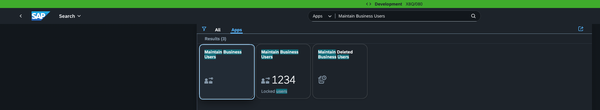
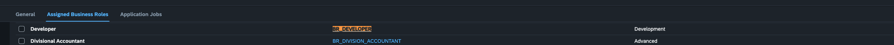
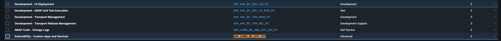
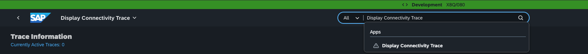
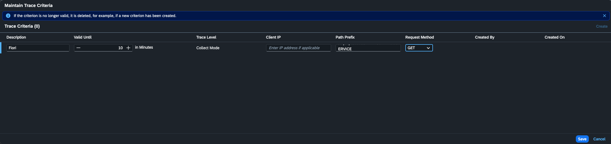
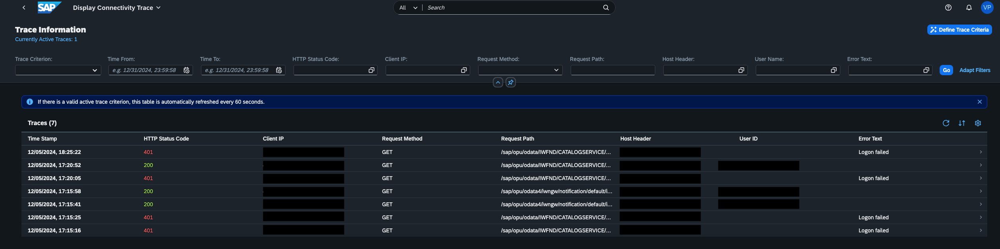

# `SAMLAssertion` Destination Configured to Point to an SAP S/4HANA Cloud Public Tenant

## Prerequisites

> **Important**: Ensure any HTML5 application source files you modify are under source control before making changes. Any configuration changes or scripts that alter the behaviour of your system or operating system must be carried out with the authorization of your IT support team.

1. You have completed steps 1, 2, and 3 from the [ABAP Custom UI SAP Business Application Studio Connect S4HC](https://developers.sap.com/tutorials/abap-custom-ui-bas-connect-s4hc.html) tutorial.
2. You have administrative access to your SAP S/4HANA Cloud system so you can configure and debug connectivity issues.
3. You have established trust and federation between SAP Authorization and Trust Management Service and SAP Cloud Identity Services, such as OpenID Connect. For more information, see [Establish Trust and Federation Between SAP Authorization and Trust Management Service and SAP Cloud Identity Services](https://help.sap.com/docs/btp/sap-business-technology-platform/establish-trust-and-federation-between-uaa-and-identity-authentication).
4. You are subscribed to SAP Business Application Studio. For more information, see [Subscribe to Business Application Studio](https://help.sap.com/docs/SAP%20Business%20Application%20Studio/9d1db9835307451daa8c930fbd9ab264/6331319fd9ea4f0ea5331e21df329539.html).
5. You have reviewed [SAP S/4HANA Cloud, Public Edition FAQ](https://me.sap.com/notes/3445942).
6. You have reviewed the [SAP Business Application Studio Integration with SAP S/4HANA Cloud](https://me.sap.com/notes/3297481) documentation.

## Create an SAP BTP `SAMLAssertion` Destination to Consume OData V2 and OData V4 Catalogs

For step-by-step instructions with screenshots, see [Create an SAP BTP `SAMLAssertion` Destination to Consume OData V2 and OData V4 catalogs](SAMLAssertionDestination.md).

## How `SAMLAssertion` Works

1. The Communication System on SAP S/4HANA Cloud validates the SAML Issuer and signature.
2. It then maps the user ID and ID format.
3. The user with the same subject ID must exist in both the SAP S/4HANA Cloud and SAP BTP systems.

### `NameID` Format in SAP BTP Destination

In your SAP BTP destination, the `nameIdFormat` property affects the behavior of user ID mapping against your SAP S/4HANA Cloud instance.

- `urn:oasis:names:tc:SAML:1.1:nameid-format:emailAddress`: User ID maps to the email address.
- `urn:oasis:names:tc:SAML:1.1:nameid-format:unspecified`: User ID maps to the username.

**Notes:**

1. Ensure the version `1.1` is not changed to a later version, unless specified by the relevant service providers.
2. Unless you have a specific technical reason, the `nameIdFormat` must be set to `urn:oasis:names:tc:SAML:1.1:nameid-format:emailAddress`, by default. The email address as defined in your IdP, such as OpenID Connect or IAS, must match the S4HC email address configured with the appropriate roles. For more information about adding other IdPs to your SAP BTP system, see [Related Links](#related-links).
3. The SAML `nameIdFormat` specification, versions 1.1 and 2.0, does not mandate any case normalization for `NameID` values because it treats the `NameID` as an opaque identifier. However, the meaning and comparison are left up to the service providers. For best practice, ensure the email address in the IdP matches the email address in S4HC exactly, with case sensitivity observed.

## Basic Authentication

When integrating with SAP S/4HANA Public Cloud, Basic Authentication is generally not recommended because the platform is designed to use secure identity federation and token-based authentication mechanisms.

This approach provides several benefits:

1. Avoids storing credentials in the destination configuration.
2. Aligns with the security model used by SAP S/4HANA Public Cloud.
3. Allows authentication to be managed through trust configuration and tokens.

## Authorization Requirements

Different authorizations are required for various operations in SAP S/4HANA Cloud, such as:

- Accessing catalog services to browse available OData Services
- Running previews and accessing OData Services
- Deploying SAPUI5 applications in SAP S/4HANA Cloud

Add the specific `Business Role` to allow a specific user to `deploy` and `undeploy` SAPUI5 applications. All other users can be assigned the `OData Services` role.

| Business Catalog                       | Key User Extensibility and Customizing (client 100) | Developer Extensibility (client 080)  |
|----------------------------------------|-------------------------------------------------|---------------------------------------|
| To access OData Services (Preview Mode)| SAP_CORE_BC_EXT_TST                             | SAP_CORE_BC_EXT_TST                   |
| To deploy application                  | SAP_CORE_BC_EXT_UI                              | SAP_A4_BC_DEV_UID_PC                  |
| Business Role                          | SAP_BR_EXTENSIBILITY_SPEC                       | SAP_BR_DEVELOPER                      |

Create business roles based on business role templates. The recommended business role templates are `SAP_BR_DEVELOPER` and `SAP_BR_EXTENSIBILITY_SPEC`.

In some instances, the name of the business role may differ or the specific business catalogs are added to an existing business role that is not `SAP_BR_DEVELOPER` or `SAP_BR_EXTENSIBILITY_SPEC`. For example, `BR_DEVELOPER` or `Z_BR_DEVELOPER`. OData APIs must be explicitly activated using Communication Arrangements to prevent unauthorized systems from enumerating API's.

For more information about roles and catalogs, see [Creating a Custom SAP Fiori Application Using SAP Business Application Studio](https://help.sap.com/docs/SAP_S4HANA_CLOUD/0f69f8fb28ac4bf48d2b57b9637e81fa/a71e8ffa917545c8af0a7c77992f8eba.html?q=SAP_CORE_BC_EXT_UI).

## Tenant Types

**Developer Note**
The following information is based on the SAP S/4HANA Cloud (3SL) version where the tenant type is defined as `Developer Extensibility` or `Key User Extensibility/Customizing` and requires a different SAP BTP destination to reflect the different host endpoints. A new communication system with the associated SSL Certificate is exposed per host or tenant type.

There are key differences between an SAP S/4HANA Cloud 2-System Landscape and a 3-System Landscape. For more information, see [System Landscapes in SAP S/4HANA Cloud Public Edition](https://help.sap.com/docs/SAP_S4HANA_CLOUD/a630d57fc5004c6383e7a81efee7a8bb/aa60b129af7b4ce8ae052618c8315d29.html).

### Developer Extensibility (SAP Client 080)

**Purpose:** Facilitates developer extensibility within the SAP S/4HANA Cloud ABAP environment.

**Features:**

- Provides full ABAP development tool access to released SAP S/4HANA Cloud business objects and extension points.
- Supports the creation of advanced, cloud-ready, and upgrade-stable custom ABAP code.
- Ensures that development objects are client-independent, which allows access from other tenants if permissions are granted.
- Build your custom developments based on lifecycle-stable SAP objects.
- Only developer extensibility is supported.

Steps to generate an [SAP BTP destination for your SAP S/4HANA Cloud Developer Extensibility tenant](https://help.sap.com/docs/SAP_S4HANA_CLOUD/0f69f8fb28ac4bf48d2b57b9637e81fa/0af2819bbe064a3da455753c8518dd81.html?version=2502.500).

### Key User Extensibility and Customizing (SAP Client 100)

**Purpose:** Serves as the primary environment for configuration and customization activities.

**Features:**

- Allows for the setup and adjustment of system settings to meet specific business requirements.
- Acts as a bridge between development and testing activities, which ensures that custom developments are appropriately integrated and tested.
- Configuration activities based on the reference content from SAP Central Business Configuration.
- To make your configuration content available in the test and production systems, you must transport them.
- Create low-code custom developments in key user apps.
- In Customizing Tenant, only Key User Extensibility is supported.
- Form Templates are under the Key User Extensibility category, so you can only create a Form Template in customizing tenants.

Steps to generate an [SAP BTP destination for your SAP S/4HANA Cloud Key User Extensibility and Customizing tenant](https://help.sap.com/docs/SAP_S4HANA_CLOUD/0f69f8fb28ac4bf48d2b57b9637e81fa/31876c06f99645f289d802f9c95fb62b.html?version=2502.500).

### Steps for Developer Extensibility Tenant

To ensure your specific user has the appropriate `SAP_BR_DEVELOPER` role to consume OData XML services, and deploy SAPUI5 applications, edit your specific S4HC user.

Search for the "Maintain Business Users" application:


Select your specific user and select "Assigned Business Roles":



If `SAP_BR_DEVELOPER` is missing, select "Add" and search for `SAP_BR_DEVELOPER` to append the business role to your specific user.

Next, select the `SAP_BR_DEVELOPER` role that you just added, select `Business Catalogs` and ensure `SAP_CORE_BC_EXT_TST` and `SAP_A4_BC_DEV_UID_PC` are added:



The same steps can be used to append the `SAP_BR_EXTENSIBILITY_SPEC` business role for a `Key User Extensibility/` tenant.

## Debugging Connectivity Issues

### Authorisation Failures

Using the search option on your SAP S/4HANA instance, review failed requests using the [Display Authorization Trace](https://help.sap.com/docs/SAP_S4HANA_CLOUD/55a7cb346519450cb9e6d21c1ecd6ec1/ebb91d3758c441b18bf9ebd0798d424e.html) documentation as an SAP S/4HANA Administrator.

Filter by:

- Status: `Failed`
- Users, filtered by the required user details. Select the user from the list.

### Connectivity Failures

Using the search option on your SAP S/4HANA instance, you can also review the failed requests using the `Display Connectivity Trace` as an SAP S/4HANA Administrator.

Filter by request path = `/sap/opu/odata/IWFND/CATALOGSERVICE` to see calls to the OData V2 catalog service, request method is `GET`

Filter by request path = `/sap/opu/odata4/iwfnd/config/default/iwfnd/catalog/` to see calls for the OData V4 catalog service, request method is `GET`

For more information, see the [Display Connectivity Trace](https://help.sap.com/docs/SAP_S4HANA_CLOUD/0f69f8fb28ac4bf48d2b57b9637e81fa/a4f6ccd072f147f299b1d856062c8dc8.html) documentation.

Search for the "Display Connectivity Trace" application:



Define a new trace using the `Request Method` of `GET` and the `Path Prefix` of `/sap/opu/odata/IWFND/CATALOGSERVICE`, then click save:


The new trace populates the table when new events are found:



For more information, see [Validate Destination Configuration](https://ga.support.sap.com/index.html#/tree/3046/actions/45995:48363:53594:54336:51208).

## Debugging Connectivity and Deployment Issues

### The Deployment Fails with `The use of Gateway OData V2 Service Z_MY_SERVICE 0001 is not permitted.`

```bash
error abap-deploy-task YY1_Some_Service The use of Gateway OData V2 Service Z_MY_SERVICE 0001 is not permitted.
```

For more information about how to resolve this issue, see [SAP Knowledge Base Article 3373955](https://userapps.support.sap.com/sap/support/knowledge/en/3373955).

The issue is caused by the custom UI5 Application having the "ABAP for Cloud Development" ABAP language version, which cannot be deployed to a system that does not have the "ABAP for Key Users" ABAP language version.

### Deployment Fails with HTTP 403

```bash
info abap-deploy-task YY1_Some_App Creating archive with UI5 build result.
info abap-deploy-task YY1_Some_App Archive created.
info abap-deploy-task YY1_Some_App Starting to deploy.
info abap-deploy-task YY1_Some_App YY1_Some_Service found on target system: false
error abap-deploy-task YY1_Some_App Request failed with status code 403
```

For an HTTP 403 error, you can check the `Display Connectivity Trace` as an SAP S/4HANA Administrator to see why the request is failing. This is often related to the following configuration issues:

- Your SAP BTP destination, defined in your `SAP BTP subaccount`, is not configured with `SAMLAssertion`. Deployment is only supported using `SAMLAssertion`. A destination created with any other authentication type fails.
- The user logged into SAP Business Application Studio does not have the required `Business Role` assigned to allow the user to deploy the application. The user must have the `SAP_CORE_BC_EXT_UI` or `SAP_A4_BC_DEV_UID_PC` role assigned to allow the user to deploy the application.
- SAP BTP trust certificate renewal can cause connectivity issues. The active SAP BTP trust certificate is renewed and published with a new `Validity` date range. When this occurs, the renewed certificate must be uploaded to the target SAP S/4HANA Cloud system to restore trust and allow successful deployment or connectivity.
- Ensure that the email address in your Identity Provider (IdP) matches the SAP OCID (user ID) in your SAP S/4HANA Cloud system exactly. The email addresses are case-sensitive and must match precisely.

### Deployment Fails with HTTP 400

```bash
error The app uses not permitted services for ABAP for Cloud Development
error abap-deploy-task ZF_TEST_API Request failed with status code 400
error abap-deploy-task ZF_TEST_API The use of Gateway OData V2 Service API_PROC_ORDER_CONFIRMATION_2_SRV 0001 is not permitted
```

For more information, see [Tenant Types](./README.md#tenant-types), as each tenant type has a different set of OData services that are allowed to be used or consumed.

For more information about how to resolve this issue, see the [Q&A](https://userapps.support.sap.com/sap/support/knowledge/en/3445942) documentation.

### Calling OData V2 or OData V4 Catalogs Does Not Include Specific OData Services

When calling either of the OData V2 or OData V4 catalogs, you may encounter an issue where specific OData services are not included in the response. This can occur if the user does not have the required authorizations or if the service is not available in the catalog.

Example of calling the OData V2 and OData V4 catalogs:

```bash
#V2 Catalog
/sap/opu/odata/IWFND/CATALOGSERVICE;v=2/ServiceCollection
#V4 Catalog
/sap/opu/odata4/iwfnd/config/default/iwfnd/catalog/0002/ServiceGroups?$expand=DefaultSystem($expand=Services)
```

A list of standard OData services, typically available in the [SAP Business Accelerator Hub](https://api.sap.com/).

If your OData service is not listed, then your OData V2 and OData V4 catalogs are limited to custom services.

This issue can be related to a missing authorisation. For more information, see [Authorization Requirements](./README.md#authorization-requirements) to ensure your user has the required authorizations to access the standard OData services.

### Support Communication Users

You may need to create a support communication user to allow SAP Support to access your SAP S/4HANA Cloud system. This is typically required for troubleshooting and debugging purposes.
However, if you want the user to access the OData V2 or V4 catalogs, you must ensure that the user has the required authorizations and roles assigned. You must also change how the SAP BTP destination is configured.

The best method is to clone your existing SAP BTP destination and change the type to a partial URL destination. This allows you to specify the `Service URL` as the base URL for the OData V2 or V4 catalog, and then append the specific service path to the destination URL.

For more information about configuring a partial URL destination, see [Partial URL Destination Configuration](https://ga.support.sap.com/dtp/viewer/index.html#/tree/3046/actions/45995:48363:53594:52803).

### Standard OData Services Are Not Displayed in `RecommendedServiceCollection`

For more information about how to troubleshoot this issue, see [Recommend Services](./RecommendServices.md).

### No OData Services Available in the OData V2 Catalog

For more information, see [Exposing an OData Service from SAP S/4HANA Cloud Public Edition to the SAP BTP](https://community.sap.com/t5/technology-blog-posts-by-sap/exposing-an-odata-service-from-sap-s-4hana-cloud-public-edition-to-the-sap/ba-p/13628248).

### All HTTP API Requests from SAP Business Application Studio to SAP S/4HANA Cloud Fail

#### Assumes S4HC Connectivity Is Established

1. You have activated either the authorization or connectivity trace logging on your S4HC instance and confirmed the requests are hitting your S4HC instance.
2. The communication system for SAP Business Application Studio is not active. For more information, see [Create a Communication System for SAP Business Application Studio](https://help.sap.com/docs/SAP_S4HANA_CLOUD/0f69f8fb28ac4bf48d2b57b9637e81fa/79ed4173a0e44a5085c2d236d14b5ab8.html).
3. The user logged into SAP Business Application Studio does not have the required `Business Role` assigned to allow the user to consume OData services. The user must have the `SAP_BR_DEVELOPER` role assigned to allow the user to consume OData services. For more information, see [Authorization Requirements](./README.md#authorization-requirements).

#### Assumes There Is No Connectivity to Your S4HC Instance

1. You have either activated the authorization or connectivity trace logging on your S4HC instance and confirmed that _no_ requests are hitting your S4HC instance.
2. If the `nameIdFormat` in your SAP BTP destination is set to `urn:oasis:names:tc:SAML:1.1:nameid-format:emailAddress`, ensure the email address in your Identity Provider (IdP) matches the email address configured for your user in your S4HC instance.
3. After running a `curl` command or [Environment Check](../destinations/README.md#environment-check), all requests fail with HTTP 500 and do not reach your SAP S/4HANA Cloud instance. Your SAP BTP destination may be corrupted. Clone the existing destination and use the new destination in your SAP Business Application Studio instance.

## SAP Fiori Launchpad

Since application availability in the SAP Fiori launchpad and its authorization are controlled through Business Catalogs, extend an existing catalog to include your newly created app.

For a step-by-step walkthrough, see the tutorial group [Develop an SAP Fiori App for SAP S/4HANA Cloud with ABAP using SAP Business Application Studio](https://developers.sap.com/group.abap-custom-ui-s4hana-cloud.html).

> Tutorial last checked for feasibility with SAP S/4HANA Cloud Release 2508.

When using SAP Fiori tools, see step 8 of the [Configure SAP Fiori launchpad settings and generate](https://developers.sap.com/tutorials/abap-custom-ui-bas-develop-s4hc.html) tutorial.

## Related Links

- [Integrating SAP Business Application Studio](https://help.sap.com/docs/SAP_S4HANA_CLOUD/0f69f8fb28ac4bf48d2b57b9637e81fa/22bc724fd51a4aa4a4d1c5854db7e026.html)
- [Develop a Custom UI for an SAP S/4HANA Cloud System](https://developers.sap.com/tutorials/abap-custom-ui-bas-develop-s4hc.html)
- [Create an SAP Fiori App and Deploy it to SAP S/4HANA Cloud, ABAP Environment](https://developers.sap.com/tutorials/abap-s4hanacloud-procurement-purchasereq-shop-ui.html)
- [Set Up Trust Between SAP Cloud Identity Services and SAP BTP, Cloud Foundry Environment](https://developers.sap.com/tutorials/abap-custom-ui-trust-cf.html)
- Required when adding another trust configuration that uses a different identity provider. For example, where you are adding an IAS provider to manage your user profiles.
- The trust protocol defined in your new IdP must be `SAML` to ensure the `SAMLAssertion` configuration in your SAP BTP destination works when connecting to your S4HC instance using `SAMLAssertion`.

- [User Management in a Nutshell](https://community.sap.com/t5/enterprise-resource-planning-blogs-by-sap/user-management-in-a-nutshell-for-the-sap-s-4hana-cloud-public-edition/ba-p/13556782) blog post

## Develop an SAP Fiori Application UI Using Developer Extensibility Tenant (DEV/080)

For more information about developing an SAP Fiori application UI using the Developer Extensibility tenant, see [Developing an SAP Fiori Application UI Using Developer Extensibility Tenant in SAP S/4HANA Cloud, Public Edition](https://help.sap.com/docs/SAP_S4HANA_CLOUD/6aa39f1ac05441e5a23f484f31e477e7/2a4ae231df8843379df7a36fa3462d4c.html).

This development approach uses the ABAP Development Tools (ADT) in Eclipse IDE connected to your SAP S/4HANA Cloud, Public Edition Developer Extensibility tenant and is not related to SAP Business Application Studio or SAP Fiori tools.

Any related support issues must be raised against the `BC-SRV-APS-IAM` support component.

## License

Copyright (c) 2009-2026 SAP SE or an SAP affiliate company. This project is licensed under the Apache Software License, version 2.0 except as noted otherwise in the [LICENSE](../../LICENSES/Apache-2.0.txt) file.
