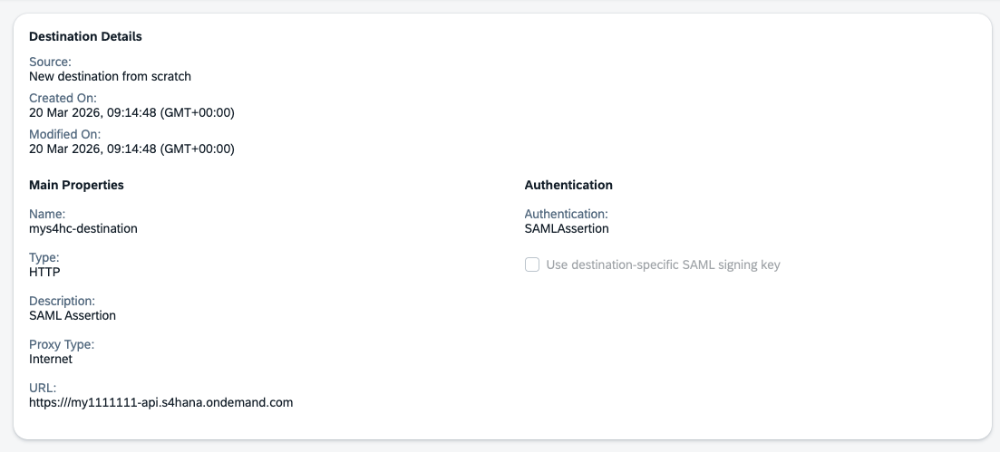
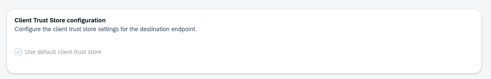
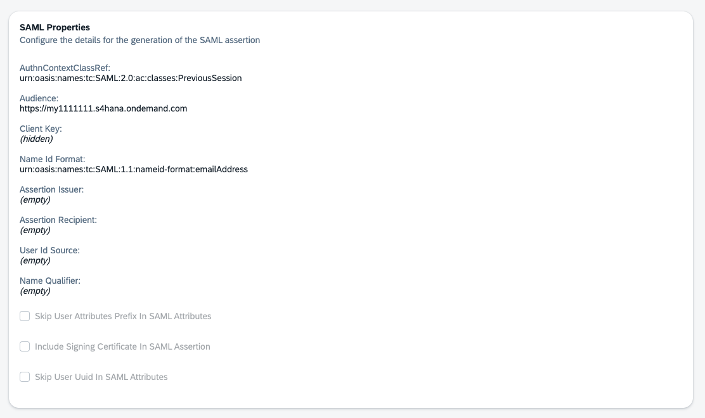
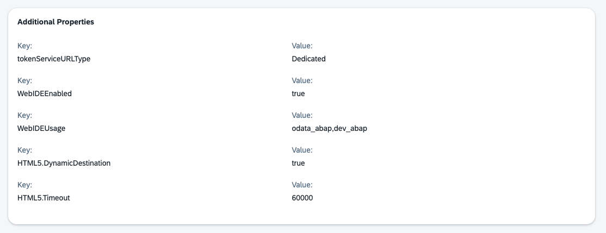

# Create a SAP BTP SAMLAssertion Destination to Consume V2 and V4 OData Catalogs

1. Open the [s4hana-cloud_saml](s4hana-cloud_saml) file using a text editor or browser.
2. Replace all instances of `my1111111` with your specific hostname.
3. Log in to your SAP BTP subaccount, select the `Destinations` tab, and select `Import Destination`.
4. Log in to SAP Business Application Studio to consume the new destination to validate that the connection works.

For more information, see [Create a Destination to Connect to SAP Business Application Studio](https://help.sap.com/docs/SAP_S4HANA_CLOUD/0f69f8fb28ac4bf48d2b57b9637e81fa/31876c06f99645f289d802f9c95fb62b.html).

## Correctly Configured Destination

The following screenshots show what the SAP BTP destination looks like once correctly created.

**Destination details and main properties** — type is `HTTP`, authentication is `SAMLAssertion`, and the URL points to your S/4HANA Cloud hostname:

**Client Trust Store configuration** — `Use default client trust store` must be checked:

**SAML properties** — shows the `AuthnContextClassRef`, `Audience` URL, and `Name Id Format` set to `emailAddress`:

**Additional properties** — required keys for SAP Business Application Studio integration:

| Key | Value |
|---|---|
| `tokenServiceURLType` | `Dedicated` |
| `WebIDEEnabled` | `true` |
| `WebIDEUsage` | `odata_abap,dev_abap` |
| `HTML5.DynamicDestination` | `true` |
| `HTML5.Timeout` | `60000` |

## License

Copyright (c) 2009-2026 SAP SE or an SAP affiliate company. This project is licensed under the Apache Software License, version 2.0 except as noted otherwise in the [LICENSE](../../LICENSES/Apache-2.0.txt) file.
