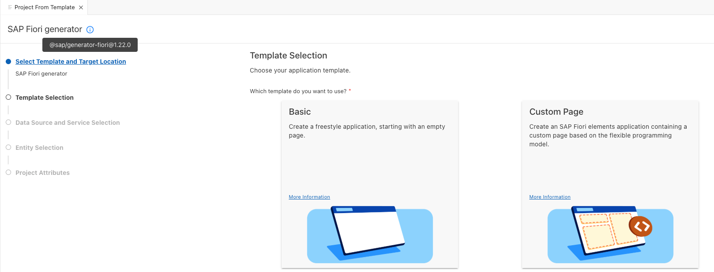

# SAP Fiori Tools Generator

The SAP Fiori tools generator (`@sap/generator-fiori`) is the core Yeoman-based generator used to scaffold SAP Fiori elements and freestyle SAPUI5 applications.

## Table of Contents

- [Tracking the Latest Version](#tracking-the-latest-version)
- [Determining the Installed Version](#determining-the-installed-version)
- [Identifying the Generator Version Used to Create an Application](#identifying-the-generator-version-used-to-create-an-application)

## Tracking the Latest Version

The generator is published to npm under the package name `@sap/generator-fiori`. You can track available versions, including the latest stable release, on the npm registry:

- [npm: @sap/generator-fiori: Versions](https://www.npmjs.com/package/@sap/generator-fiori?activeTab=versions)

The current latest stable version is `1.22.0`.

To check the latest version from the command line, run:

```bash
npm info @sap/generator-fiori dist-tags
```

To install or update to the latest version:

```bash
npm install -g @sap/generator-fiori
```

## Determining the Installed Version

When the SAP Fiori generator is open, hover over the info icon (&#9432;) next to the **SAP Fiori generator** heading. A tooltip displays the currently installed version, for example `@sap/generator-fiori@1.22.0`.



## Identifying the Generator Version Used to Create an Application

To validate which version of the generator was used to create an existing SAPUI5 application, open the application's `manifest.json` file. It contains a `sourceTemplate` node that records the tool and version used at the time the project was scaffolded:

```json
"sourceTemplate": {
  "id": "@sap/generator-fiori:basic",
  "version": "1.22.0",
  "toolsId": "d3f73c8f-aa06-4e70-9153-ada99d6d2391"
}
```

The `id` field identifies both the tool and the template used to generate the application, in the format `<generator>:<template>`. For example, `@sap/generator-fiori:basic` indicates the `basic` template was used with the `@sap/generator-fiori` generator, while `@sap/ux-app-migrator:freestyle` indicates a freestyle application was migrated using `@sap/ux-app-migrator`. The `version` field records the version of that tool at the time of generation.

## License

Copyright (c) 2009-2026 SAP SE or an SAP affiliate company. This project is licensed under the Apache Software License, version 2.0 except as noted otherwise in the [LICENSE](/LICENSES/Apache-2.0.txt) file.
