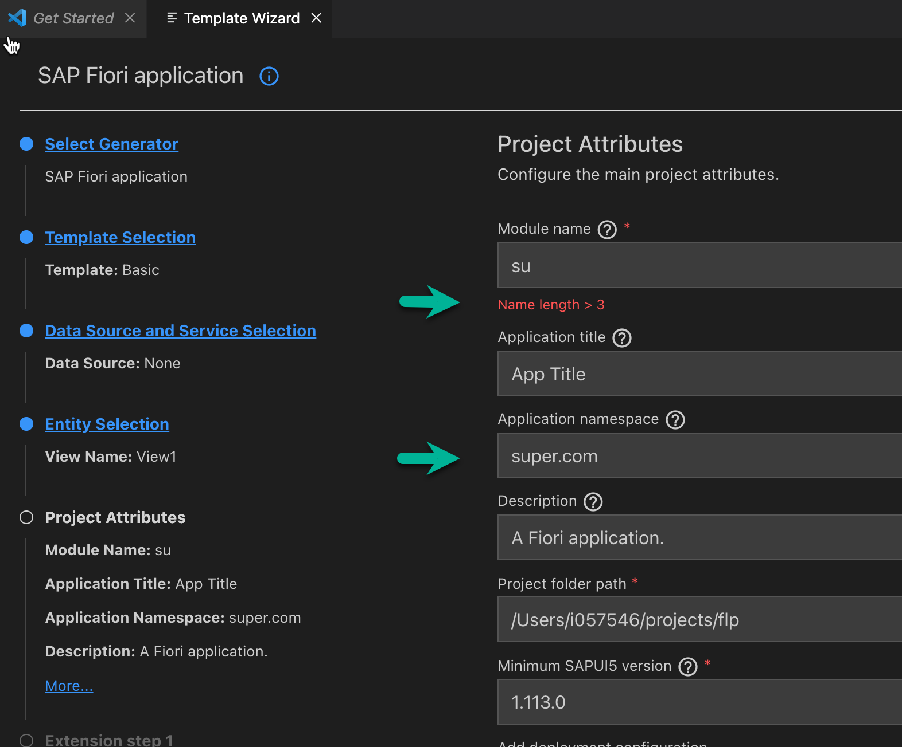
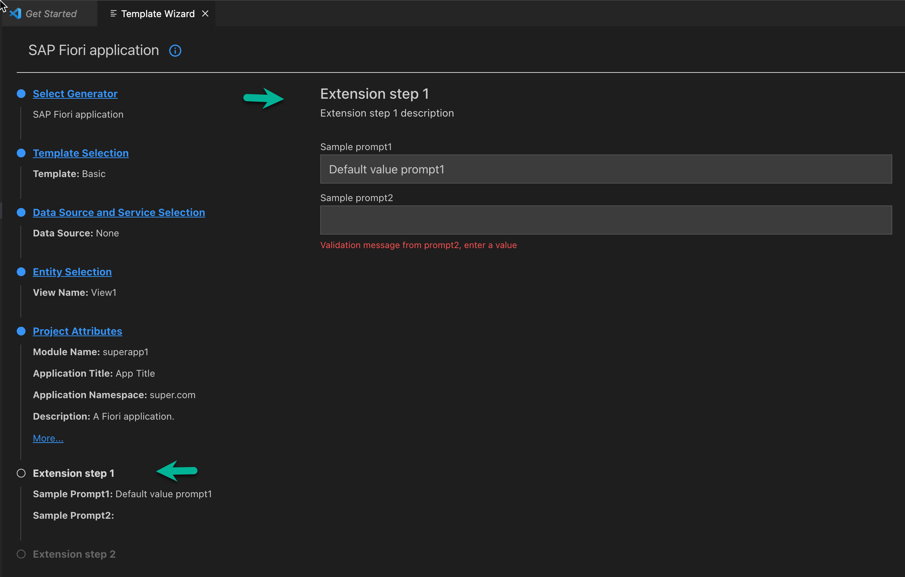

# Sample SAP Fiori Generator Extension Sub-Generator

This module demonstrates how to extend `@sap/generator-fiori` by adding steps and prompts and customizing existing prompt validators and default values.

## Building and Installing the Sample SAP Fiori Generator Extension

1. Clone this repo locally.
2. Run `yarn install` in the `sample-fiori-gen-ext` directory. `yarn` must be installed globally.

### Local Testing
1. Build the extension sample using `yarn bundle`.
2. Create the installable artefact by running `npm pack`.
3. Install the tgz globally using `npm i -g <path-to-generated-tgz>`.

### Bundling to Deploy to Business Application Studio
To ensure the startup time for a dev space is not negatively impacted, bundle the extension first. An example of bundling using `esbuild` is included. Note that `shelljs` is included as a dependency as a workaround for a known `esbuild` issue:
1. Bundle the extension sample using `yarn bundle`.
2. The bundle must be checked in to the repo for deployment using the WEX tool (ADD LINK!!!).
3. To test locally, create the installable artefact by running `npm pack`.
4. To test locally, install the tgz globally using `npm i -g <path-to-generated-tgz>`.

Note: To push the extension generator to a repo, replace step 3 by executing the `Draft a new release` GitHub action from the GitHub web app. 
Replace step 4 with the WEX tool configuration to deploy to SAP Business Application Studio dev spaces.


To use the sample extension, run the SAP Fiori generator using the Application Wizard VS Code extension in SAP Business Application Studio or directly in VS Code. A CLI version is also supported. Once the sample extension has been installed globally, the additional steps are visible on the navigation panel in the Application Wizard when using the "SAP Fiori application" generator with `@sap/generator-fiori` version `1.9.7` and above.

## How to Provide an Extension Generator

Extension generators are loaded during SAP Fiori generator initialization. These must be installed as node modules into one of the following locations:

- The global `npm` module location. Run `npm -g root` to view the location. Install using `npm install -g <extension-module-tgz>`.
- Any of the standard install locations in an SAP Business Application Studio dev space.
- The custom location defined by the VS Code setting: `Application Wizard: Installation Location`.

There are a few important settings required for the extension to be found.

1. The package name, and therefore installed module folder name, must include the `fiori-gen-ext` string. 
2. The `package.json` file must include the keyword: `"fiori-generator-extension"`. Note: The keyword: `yeoman-generator` must also be included to indicate to Yeoman that this is a generator.

For example, `package.json` file:
```json
{
    name: "@acme/acme-fiori-gen-ext",
    keywords: [
        "fiori-generator-extension"
    ]
}
```

For more information about the extension generator, see [SAP Fiori Tools Samples - sample-fiori-gen-ext](https://github.com/SAP-samples/fiori-tools-samples/sample-fiori-gen-ext).


## Implementing the `FioriGeneratorExtensionAPI` to Extend the SAP Fiori Generator

Extension generators are essentially generators which utilize the `composeWith` functionality provided by Yeoman that additionally implement the `FioriGeneratorExtensionAPI` interface:

```typescript
export interface FioriGeneratorExtensionAPI {
    /**
     * Returns the settings to control some prompt and generation options
     */
    _getSettings?: () => FioriGeneratorSettings;
    /**
     * Returns the extensions which extend existing Fiori generator prompts
     */
    _getExtensions?: () => FioriGeneratorPromptExtension;
    /**
     * Returns the navigation steps which group new prompts provided by the `prompting` phase
     */
    _getSteps?: () => Step[];
}
```

For more information, see [Yeoman Composability](https://yeoman.io/authoring/composability.html).

All required type definitions can be imported from the module `@sap/generator-fiori`.

## Customizing Existing Prompts

Existing SAP Fiori generator prompts can be extended by providing an implementation of the `_getExtensions` function interface from a generator. 

Prompts (questions) definitions are based on the `Inquirer.js` JSON structure as defined in the [Inquirer.js](https://github.com/SBoudrias/Inquirer.js/tree/master/packages/inquirer#questions) documentation.
A limited set of prompts can be customized by providing properties for `default` and `validate`. These prompts appear on the Project Attributes step and are identified by name:

- name: module name
- title: application title
- namespace: application namespace
- description: application description
- targetFolder: the absolute path where the application is generated
- ui5Version: the minimum SAPUI5 version defined in the application `manifest.json` file

The complete set of extendable prompts is defined by the `promptName` definition exported by the [`@sap-ux/ui5-application-inquirer`](https://www.npmjs.com/package/@sap-ux/ui5-application-inquirer. However, `@sap-ux/ui5-application-inquirer` provides extensive customization using the `OdataServicePromptOptions` export type.
The following example shows how to provide `_getExtensions`: 

```typescript
...
import { FioriGeneratorExtensionAPI, FioriGeneratorPromptNames } from "@sap/generator-fiori";

...
class extends Generator implements FioriGeneratorExtensionAPI
...
// Get the Fiori generator "Project Attributes" step main question names
const { projectAttributes: { mainQuestions: questionNames } } = FioriGeneratorPromptNames;
...
...
    // Provide the extension prompts
    _getExtensions(): FioriGeneratorPromptExtension {
        this.log(`Getting extension defintions`);
        const extensions = {
            "@sap/generator-fiori": {
                [questionNames.name]: {
                    validate: (input: string): boolean | string => {
                        if (input.length < 3) {
                           return "Name length > 3";
                        }
                        return true;
                    },
                    default: "superapp1",
                }
            }
        }
        return extensions;
    }
...
```

The app name input for the generated app additionally validates that the input string has a length greater than three. If the length of the input string is less than three, a validation message appears and progress is blocked. Any other validations assigned to the prompt are also executed and all validations, both custom and internally defined, must return `true` before the input is valid.

The default value in the preceding example is "superapp1".




> **Note:** Default values are only dynamically applied where prompts have been defined with the `applyDefaultWhenDirty` GUI option or an answer has not been provided by the user. The `applyDefaultWhenDirty` setting is not assignable by a customized prompt extension and the behaviour must be tested to determine if it is applied when other prompt answers are updated.

Add more entries, one per question name, to the returned extension object as required.

## Adding New Steps to the SAP Fiori Generator UI

To add new questions to the SAP Fiori generator, the name and description of the navigation items must be provided. For more information, see [SAP Fiori Tools Samples - sample-fiori-gen-ext](https://github.com/SAP-samples/fiori-tools-samples/sample-fiori-gen-ext).

```typescript
...
import { FioriGeneratorExtensionAPI } from "@sap/generator-fiori";
import { IPrompt as YUIStep } from "@sap-devx/yeoman-ui-types";
...
class extends Generator implements FioriGeneratorExtensionAPI {
...
    async prompting(): Promise<void> {
        this.log('Sample Fiori generator extension: prompting()');
        // These are the prompts for the first step
        const answersPrompt1 = await this.prompt([
            {
                type: "input",
                guiOptions: {
                breadcrumb: true,
                },
                name: "prompt1",
                message: "Sample prompt1",
                default: 'Default value prompt1',
                validate: (val, answers): boolean | string =>
                    val ? true : "Validation message from prompt1, enter a value"
            },
            {
                type: "input",
                guiOptions: {
                breadcrumb: true,
                },
                name: "prompt2",
                message: "Sample prompt2",
                validate: (val, answers): boolean | string =>
                val ? true : "Validation message from prompt2, enter a value"
            }
        ]);
        this.log(`Answers from sample sub-generator "Extension step 1" prompts:  ${JSON.stringify(answersPrompt1)}`);
        // These are the prompts for the second step
        const answersPrompt2 = await this.prompt([
            {
                type: "input",
                guiOptions: {
                breadcrumb: true,
                },
                name: "prompt3",
                message: "Sample prompt3",
                default: () => this.fioriGeneratorState.project.namespace || ""
            },
            {
                type: "input",
                guiOptions: {
                breadcrumb: true,
                },
                name: "prompt4",
                message: "Sample prompt4"
            }
        ]);
        this.log(`Answers from sample sub-generator "Extension step 2" prompts:  ${JSON.stringify(answersPrompt2)}`);
        // Assign local answers for access in following phases
        this.localAnswers = Object.assign({}, answersPrompt1, answersPrompt2);
    }
    // Return the nav steps that will be added to the LHS navigation panel
    // Note: for each step there must be one call to prompt()
    _getSteps(): YUIStep[] {
        return [
            {
                name: "Extension step 1",
                description: "Extension step 1 description",
            },
            {
                name: "Extension step 2",
                description: "Extension step 2 description",
            }
        ];
    }
...
}
```
The preceding implementation produces:



Adding steps conditionally, that is, based on the value of a previous answer, can be achieved using a slightly more complex approach. For more information, see the [yeoman-ui generator-foodq](https://github.com/SAP/yeoman-ui/tree/master/packages/generator-foodq) documentation.

## Updating or Writing Files in the SAP Fiori Generator Extension

Internally, SAP Fiori generator uses the Yeoman `composeWith` functionality to add the generator extension. This means that each lifecycle phase of the extended generator runs in the run loop order. For more information, see [Generator Runtime Context](https://yeoman.io/authoring/running-context.html). SAP Fiori generator ensures that any extensions are always added after the prompting phase so that they receive the values of previous answers, and that they are added to the end of the run loop so that when the `writing` phase runs, the generated files already exist in memory. This is convenient when extensions must extend, update, or write new files. 

The in-memory file system can be accessed using the `this.fs` reference. See the following example for how to implement the `writing` phase in an SAP Fiori generator extension:

```typescript
...
    async writing(): Promise<void> {
        const manifestPath = this.destinationPath('webapp', 'manifest.json');
        // Write a new file with some prompt answers
        this.fs.writeJSON(this.destinationPath('sample.json'), {
        moduleName: this.fioriGeneratorState.project.name,
        moduleNamespace: this.fioriGeneratorState.project.namespace,
        ...this.localAnswers
        });

        // Extend the application manifest.json
        this.fs.extendJSON(manifestPath, {
        'sap.app': {
            tags: {
                keywords: ["fiori", "custom extension", "acme"]
            }
        }});

        // Update the package.json, for example, by adding a dependency
        const packageJsonPath = this.destinationPath('package.json');
        if (this.fs.exists(packageJsonPath)) {
        this.fs.extendJSON(packageJsonPath, { devDependencies: { 'fast-glob': '3.2.12' }})
        };
    }
...
```

For more information, see the [SAP Fiori Tools Samples - sample-fiori-gen-ext](https://github.com/SAP-samples/fiori-tools-samples/sample-fiori-gen-ext) sample extension package.

### Deployment to Business Application Studio

For more information, see [Deploying SAP Fiori Generator Extensions to Business Application Studio](https://github.com/SAP-samples/fiori-tools-samples/sample-fiori-gen-ext/deploy_extension.md).

## More Info

For additional help, reach out using the [SAP Fiori Tools Community](https://community.sap.com/t5/c-khhcw49343/SAP+Fiori+tools/pd-p/73555000100800002345) forum or using email at <SAPFioriElements@sap.com>.

## License

Copyright (c) 2009-2026 SAP SE or an SAP affiliate company. This project is licensed under the Apache Software License, version 2.0 except as noted otherwise in the [LICENSE](../LICENSES/Apache-2.0.txt) file.

